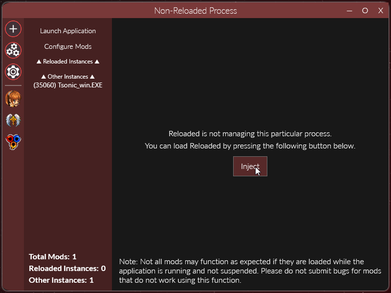

	<h1>Reloaded II: Injection Methods</h1>
	
	   
	<strong>Reloaded works with everything™</strong>
	 
    It's kind of like Guile's theme.

# Table of Contents

- [Introduction](#introduction)
  - [Synchronous Approaches](#synchronous-approaches)
    - [Manual Launch](#manual-launch)
  - [Asynchronous](#asynchronous)
    - [Auto-Inject & Inject](#auto-inject-inject)
  - [Synchronous and Asynchronous](#synchronous-and-asynchronous)
    - [DLL Loader](#dll-loader)
      - [DLL Loader Example (SADX Mod Loader)](#dll-loader-example-sadx-mod-loader)
      - [Synchronous Loading Mode](#synchronous-loading-mode)

# Introduction

There are many ways of loading Reloaded into a specific application or process.
Four are officially supported, and can be categorized as both **Synchronous** and **Asynchronous** with program startup.

**Synchronous** methods are recommended and allow for all of the mods to be initialized before the game or application starts to execute any code.

**Asynchronous** methods meanwhile load mods as the program is executing. That said some complex mods might not function as expected if loaded asynchronously.

## Synchronous Approaches
The following methods of loading Reloaded are fully synchronous.

### Manual Launch

**Summary:**

- Reloaded launches the application in a paused/suspended state.
- Reloaded is then loaded into the suspended application.
- The application is resumed.

## Asynchronous

The following methods are purely and in nature asynchronous.

### Auto-Inject & Inject

To access this menu, simply click the game instance under the "other instances" tab.

The "Inject" feature simply loads Reloaded into an existing process without having the need to restart it.

**Auto-inject** can be found inside the `Add an Application` menu, under `Advanced Tools & Options`. Auto-inject basically automatically injects Reloaded into programs as soon as they are launched.

## Synchronous and Asynchronous

The following methods of loading Reloaded support both synchronous and asynchronous loading.

### DLL Loader

Reloaded can be integrated into other ASI/DLL based mod loaders such as [Ultimate-ASI-Loader](https://github.com/ThirteenAG/Ultimate-ASI-Loader), by copying the **bootstrapper**. 

The bootstrapper is just a special DLL that loads .NET Core into an application and then boots Reloaded. **There are two bootstrappers**, one for 64-bit and one for 32-bit applications, and they can be found under the `Loader/X86` and `Loader/X64` directories respectively.

Installation will depend on the mod loader, but simply put if you copy the contents of this folder and make a mod loader mod, with `Reloaded.Mod.Loader.Bootstrapper.dll` as the target DLL (if possible), you can load Reloaded in other loaders.

#### DLL Loader Example (SADX Mod Loader)

#### Synchronous Loading Mode
By default, the bootstrapper DLL will load the mods **asynchronously**, meaning that they will be initialized as the game is normally running.

The bootstrapper however does have a feature to allow loading **synchronously**, which is **highly recommended**. The way it works is that the bootstrapper will launch the launcher with a set of commandline arguments which instruct the launcher to re-launch the game, effectively performing the `Manual Launch` launch method.

To enable synchronous loading, simply make an empty file called  `ReloadedPortable.txt`  in the same directory as the bootstrapper, as seen in the example above.

**Notes:**

- The launcher will not add any additional commandline arguments, regardless of what you may have set for the application profile. Commandline arguments set in launcher apply to launching from launcher only.
- Reloaded can and will only be loaded once, the bootstrapper has a safety mechanism to ensure that.