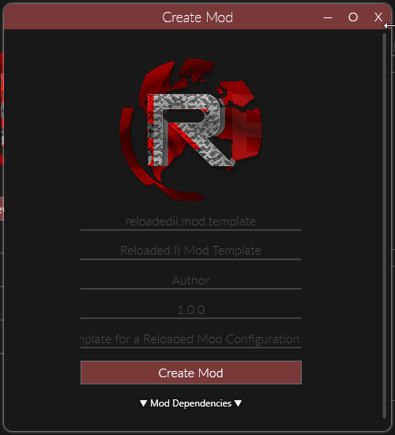
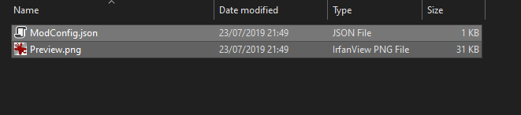
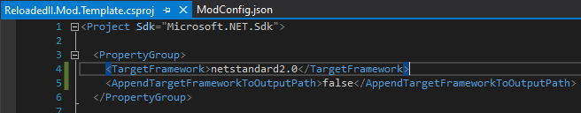

### Create a new .NET Standard Project


### Add the `Reloaded.Mod.Interfaces` NuGet package.


### Implement the `IMod` Interface.


### Add a generated mod configuration and preview image to the project.





Set their `Build Action` to Content + Copy Always.

### Unload Project and Add Two Properties in .csproj



```xml
<AppendTargetFrameworkToOutputPath>false</AppendTargetFrameworkToOutputPath>
<CopyLocalLockFileAssemblies>true</CopyLocalLockFileAssemblies>
```

