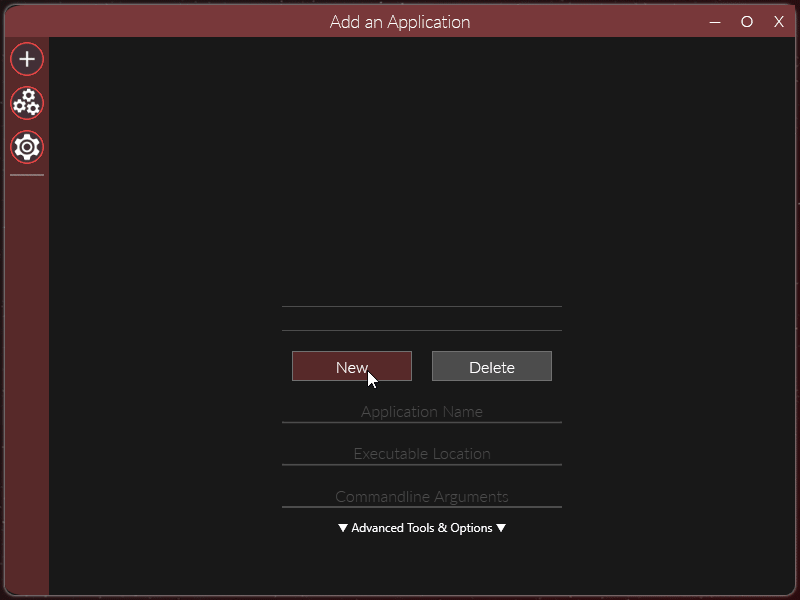

	<h1>Reloaded II: Quick Start</h1>
	
	   
	<strong>User Guides?</strong>
	 
    Who even makes these anymore?
     
    Who even READS these anymore?

# Table of Contents

# Quick Start
To run Reloaded-II, please start `Reloaded-II.exe` as administrator.

### Add an Application
To add an application such as a game, simply click the plus button on the top of the sidebar `Add an Application`. Inside the menu, click new and select an application to make a profile for:

### Download your mods.
To add mods to Reloaded, simply extract them to the `Mods` directory where you have launched the application from.