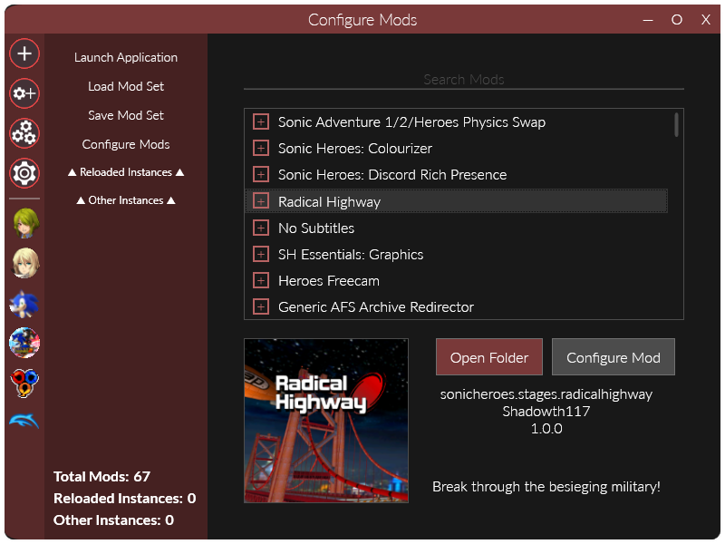

	<h1>Reloaded II</h1>
	
	   
	<strong>Nothing else matters.</strong>
	 
    Universal, C# based mod loader.
     
    Works with anything X86, X64.

## Introduction
**[Reloaded II]** is a universal DLL injection based Mod Loader and Mod Management Framework.  

	
	  

It's a fully free and open source swiss army knife for modding native games.  
Made from the ground up **proudly** using the C# programming language.  

For more information, please visit [the Reloaded-II website.](https://reloaded-project.github.io/Reloaded-II/)

For installation instructions, see [Quick Start Guide.](https://reloaded-project.github.io/Reloaded-II/QuickStart)

## Contributions

Contributions to this project are **highly encouraged**.

Feel free to implement new features, make bug fixes or suggestions so long as they are accompanied by an issue with a clear description of the pull request.

Documentation is just as welcome as code changes!
