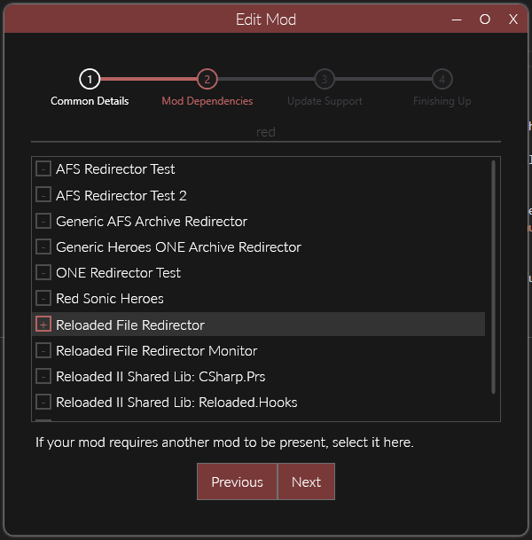
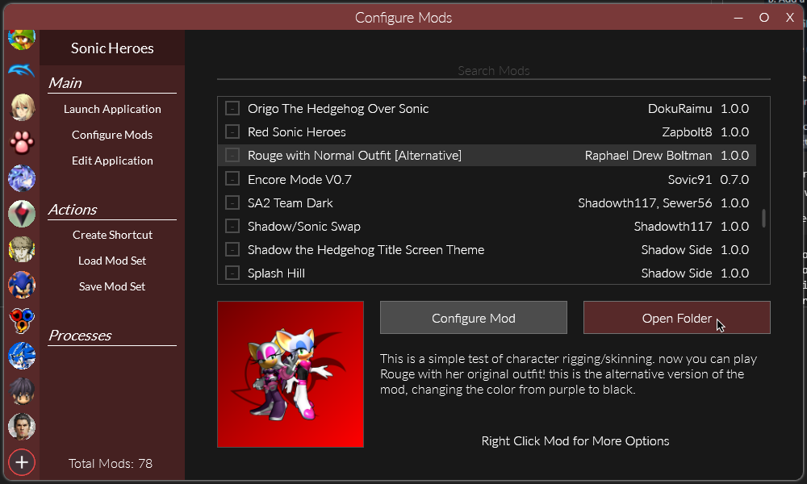

# Adding Functionality (Example)

!!! info

    The following guide will walk you through adding functionality to a your (non-code) mod through the use of other mods.  

    In this guide we will be using the universal [Reloaded File Redirector Mod](https://github.com/Reloaded-Project/reloaded.universal.redirector) to replace files that will be loaded by the game (any game!).  

## Download the Mod

First of all, download the mod which we will be using to extend the functionality of our mod. In this case, the `Reloaded File Redirector`.


## Add Dependency to Other Mod

In the `Edit Mod` menu we're going to add `Reloaded File Redirector` as a dependency.  



Adding a 'dependency' to your mod will make it such that the other mod will always be loaded when your mod is loaded. This is a necessary step. 

## Following the Guide

Mods such as `File Redirector` will typically include guides on using them; which can typically be found on their download page.  

Here is the guide for the File Redirector from the [GitHub page](https://github.com/Reloaded-Project/reloaded.universal.redirector):  


We've already done Step A by adding the dependency; let's follow the rest of this guide!

### Opening the Mod Folder



Go to the folder where your mod is stored, this can be done by simply clicking the `Open Fodler` button.  

### Add Some Files

Make a folder called `Redirector`. 
Inside it place files that we want to be replaced.  


The contents of our mod folder now look as follows.

```
// Mod Contents
ModConfig.json
Preview.png
Redirector
└─dvdroot
  ├─advertise
  │   adv_pl_rouge.one
  └─playmodel
      ro.txd
      ro_dff.one
```

The connectors `└─` represent folders.

## Summary

That's all folks.