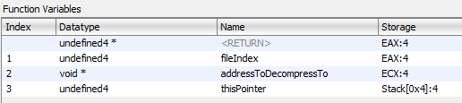

# Calling Game Functions

In the modern day, there exist multiple ways to call game functions from C#.  
In this part of the cheat sheet, we're going to focus on the most common way of calling game functions; that is through `Reloaded.Hooks`.

[Reloaded.Hooks](https://reloaded-project.github.io/Reloaded.Hooks/) is an advanced, general purpose library for manipulating native functions in memory. It was specifically created as part of the [Reloaded Project](https://github.com/Reloaded-Project) towards the journey to Reloaded-II.  

This page serves as an introduction to `Reloaded.Hooks` there are more features to the library than detailed here, consider visiting the [full documentation here](https://reloaded-project.github.io/Reloaded.Hooks/). 

Additional Resources:  
- [Reloaded.Hooks Wiki](https://reloaded-project.github.io/Reloaded.Hooks/)  
- [What is Reloaded.Hooks](https://github.com/Reloaded-Project/Reloaded.Hooks/issues/1)  

## Where to Find Reloaded.Hooks

Reloaded.Hooks comes preconfigured out of the box as part of the mod template, so you don't need to do anything special to use it.

```csharp
// From the mod template.
public Mod(IReloadedHooks hooks, ILogger logger)
{
    // IReloadedHooks: It's right here!!
}
```

## Defining Game Functions

Calling, hooking and performing other operations with native functions with Reloaded.Hooks is performed through the use of delegates. Delegates should be with Reloaded's `FunctionAttribute`.  

```csharp
// RenderWare Graphics: This function is usually step one to widescreen hacks :)
[Function(CallingConventions.Cdecl)]
public delegate void RwCameraSetViewWindow(ref RWCamera RwCamera, ref RWView view);
```

There are two `FunctionAttribute(s)`, namely `X86.FunctionAttribute` and `X64.FunctionAttribute`. Depending on the game you are working with, you may wish to apply one, the other or both.  

### Advanced Example 

!!! info

    In the real world, compilers will often optimise function calls to optimise for performance.  This will often lead to the function using non-standard conventions, such as accepting parameters via registers where normally the stack should be used.  

    This is more common in x86 (32-bit) games rather than x64 games.  

Reloaded.Hooks allows for mapping parameters to given registers.  

```csharp
/// <summary>
/// Reads a ANM/HAnim stream from a .ONE archive. Returns address of a decompressed ANM file.
/// </summary>
/// <param name="fileIndex">[EAX] The index of the file inside the .ONE archive (starting with 2)</param>
/// <param name="addressToDecompressTo">[ECX] The address to which the file inside the ONE archive will be decompressed to.</param>
/// <param name="thisPointer">"This" pointer for the ONEFILE class instance.</param>
/// <returns>The address containing the read in ANM (RenderWare Hierarchical Animation) stream.</returns>
[Function(new[] { Register.eax, Register.ecx }, Register.eax, StackCleanup.Callee)]
public delegate void* OneFileLoadHAnimation(int fileIndex, void* addressToDecompressTo, ref ONEFILE thisPointer);
/* Lifted from a disassembly of Sonic Heroes */
```

The defined function has the following properties:  
-  Two parameters (left to right) in registers EAX and ECX.  
-  Return register of EAX.  
-  "Callee" stack cleanup.  

In most non-Reloaded environments (e.g. C++ with `MinHook`) you'd usually write some custom inline assembly code to glue together your code and the optimised native function. This is not necessary here. 

#### Deciphering the Function Signature

!!! info

    Some disassemblers may contain useful information about how the function is called.  
    Below is guidance on deciphering the function signatures in some common disassemblers.  

    Please note that disassemblers are not perfect; they can and will sometimes make mistakes.
 

**IDA Pro (Decompiler):** 
```csharp
// Example
void* __userpurge OneFileLoadHAnimation@<eax>(RwUInt32 type@<eax>, void *dest@<ecx>, ONEFILE *this)

// Breakdown
FUNCTION_NAME@<eax> in function name specifies return register is EAX.
type@<eax> specifies the `type` argument is passed via EAX register.
dest@<ecx> specifies the `dest` argument is passed via ECX register.
remaining parameters are passed via stack.

// Extra Info (IDA Specific)
_userpurge == 'Callee' Stack Cleanup
_usercall == 'Caller' Stack Cleanup
```

**Ghidra:** 

Right click function name and click `Edit Function`. Inside the dialog, you will find the following:  

  

Note: Ghidra did not disassemble this correctly; I manually fixed this function for this example.  

**Binary Ninja:**

This one is pretty self explanatory.  

```csharp
// Example
void* __stdcall OneFileLoadHAnimation(int32_t arg1 @ eax, char* arg2 @ ecx, char* arg3)
```

**General:**  
Some disassemblers might not provide information on return registers and/or stack cleanup because they are implied by the given convention (such as `__stdcall`). Consider using the following presets in `Reloaded.Hooks` to determine these settings.  

- [X86 Calling Conventions (Presets)](https://github.com/Reloaded-Project/Reloaded.Hooks/blob/496d52fae5290a43ff2cbba0400b8ec46e6207b3/source/Reloaded.Hooks.Definitions/X86/CallingConventions.cs#L30)
- [X64 Calling Conventions (Presets)](https://github.com/Reloaded-Project/Reloaded.Hooks/blob/496d52fae5290a43ff2cbba0400b8ec46e6207b3/source/Reloaded.Hooks.Definitions/X64/CallingConventions.cs#L24)

## Calling Functions

To call the game function(s), create a delegate by calling `IReloadedHooks'` `CreateWrapper<T>` function.  

```csharp
// 0x0064AC80 is the address of function in native memory.  
var rwCameraSetViewWindow = hooks.CreateWrapper<RwCameraSetViewWindow>(0x0064AC80);

// You may now call the delegate instance/native/game fuction like if it was your own.  
rwCameraSetViewWindow(camera, view);
```

## Hooking Functions

!!! danger

    When you create the hook, you MUST store the returned `IHook<T>` in a place 
    where it will not be garbage collected. 
    
    Usually a class field is sufficient, otherwise use a static list/variable.  

Function hooking/calling/trampolining is performed by calling the `IReloadedHooks` `CreateHook<T>` function.  

```csharp
private IHook<CreateFileA> _createFileAHook; 

/* Constructor */
public SomeClass(IReloadedHooks hooks)
{
    // Get Address of Windows API function.
    var createFileAPointer = GetProcAddress(LoadLibraryW("kernel32"), "CreateFileA");  

    // Create the hook (don't forget to call Activate()).
    _createFileAHook = hooks.CreateHook<CreateFileA>(CreateFileAImpl, (long)createFileAPointer).Activate();
}

/* Hook Function */
private static IntPtr CreateFileAImpl(string filename, FileAccess access, FileShare share, IntPtr securityAttributes, FileMode creationDisposition, FileAttributes flagsAndAttributes, IntPtr templateFile)
{
    // Filter out non-files such as HID devices, print rest to console
    if (!filename.StartsWith(@"\\?\"))
        Console.WriteLine($"Opening File {filename}");

    // Code above this comment is executed before the original Windows API code.
    var returnValue = _createFileAHook.OriginalFunction(filename, access, share, securityAttributes, creationDisposition, flagsAndAttributes, templateFile);
    // Code under this comment is executed after the original Windows API code.

    return returnValue;
}
```

## IFunction<T\>

Worth noting due to its usefulness, `Function<T>` is a commonly used API that wraps a native function given a pointer and instance of `IReloadedHooks`.  

Usage: 
```csharp
_addFunction = new Function<Calculator.AddFunction>(functionAddress, hooks);

// With this class you can easily perform common operations, for example...
// Hook Function
_addHook = _addFunction.Hook(Hookfunction).Activate();

// Call Function
_addFunction.GetWrapper()(x, y);
```

This library is useful when you are e.g. building a library for others to use for hacking a specific game.  