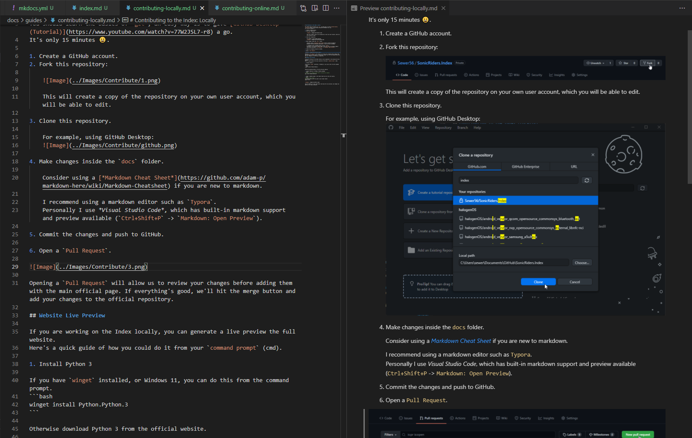

# Contributing to the Wiki: Locally

## Tutorial
You should learn the basics of `git`, an easy way is to give [GitHub Desktop (Tutorial)](https://www.youtube.com/watch?v=77W2JSL7-r8) a go.  
It's only 15 minutes 😀.

1. Create a GitHub account.
2. Fork this repository:

    

    This will create a copy of the repository on your own user account, which you will be able to edit.

3. Clone this repository.

    For example, using GitHub Desktop:
    

4. Make changes inside the `docs` folder.

    

    Consider using a [*Markdown Cheat Sheet*](https://github.com/adam-p/markdown-here/wiki/Markdown-Cheatsheet) if you are new to markdown.

    I recommend using a markdown editor such as `Typora`.  
    Personally I use *Visual Studio Code*, which has built-in markdown support and preview available (`Ctrl+Shift+P` -> `Markdown: Open Preview`). 

5. Commit the changes and push to GitHub.

6. Open a `Pull Request`.

    

    Opening a `Pull Request` will allow us to review your changes before adding them with the main official page. If everything's good, we'll hit the merge button and add your changes to the official repository.

## Website Live Preview

If you are working on the wiki locally, you can generate a live preview the full website.
Here's a quick guide of how you could do it from your `command prompt` (cmd).

1. Install Python 3

    If you have `winget` installed, or Windows 11, you can do this from the command prompt.
    ```bash
    winget install Python.Python.3
    ```

    Otherwise download Python 3 from the official website.

2. Install Material for MkDocs and Plugins (Python package)
    ```bash
    # Restart your command prompt before running this command.
    pip install mkdocs-material
    pip install mkdocs-redirects
    ```

3. Open a command prompt in the folder containing `mkdocs.yml`. and run the site locally.
    ```bash
    # Move to project folder.
    cd <Replace this with full path to folder containing `mkdocs.yml`>
    mkdocs serve
    ```

    

    Copy the address to your web browser and enjoy the live preview; any changes you save will be shown instantly.