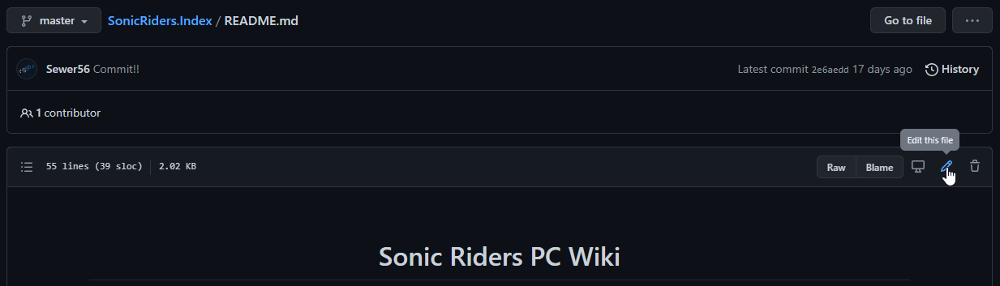

# Contributing to the Wiki: Online

*(If you want to work purely in your web browser, recommended for small changes only)*

1. Create a GitHub Account.
2. Fork this repository:

    

    This will create a copy of the repository on your own user account, which you will be able to edit.

3. Open the `docs` folder and edit the relevant (.md) pages.

    

    Consider using a [*Markdown Cheat Sheet*](https://github.com/adam-p/markdown-here/wiki/Markdown-Cheatsheet) for your editing needs.

4. Open a `Pull Request`.

    

    Opening a `Pull Request` will allow us to review your changes before adding them with the main official page. If everything's good, we'll hit the merge button and add your changes to the official repository.
