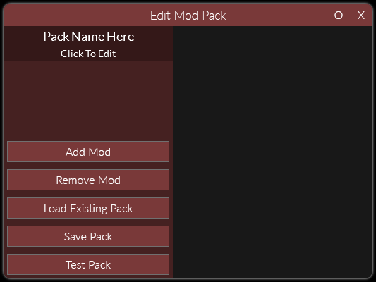

# Creating Mod Packs

For information on installing mod packs, please see [Installing Mod Packs](./InstallingModPacks.md).

## 1. Open Editor

!!! info

    You can find the mod pack editor in the (three gears) `Manage Mods` menu.  

When opened, a blank pack editor would appear on the screen.  

Click on the top left where it says (`Click to Edit`) to edit the mod pack's welcome screen.

## 2. Add A Description

!!! info "About Markdown"

    Reloaded uses Markdown [(tutorial)](https://commonmark.org/help/tutorial/index.html) for mod pack descriptions.  
    
    If you ever use *italics* and **bolds** in your Discord/Reddit posts, you're probably familiar with a small bit of Markdown. Markdown files use the file extension `.md` and can be saved/opened with any text editor.  

!!! tip

    Markdown editors such as [Dilinger](https://dillinger.io) and [Typora](https://typora.io) allow you to preview your formatted text in real time.  

To add a description to your mod, click `Set Description` and select a markdown file.  
To add an image, click `Add Image`. Clicking `Remove Image` will remove currently shown image.

## 3. Adding Mods

In order to add a mod to the pack, press the `Add Mod` button and select a mod from the list.  
If possible (i.e. mod author includes those), the pack creator will automatically add the description and images for you.  

!!! info 

    The `.r2pack` files do not contain the mods themselves, only images and text. The mods are only downloaded once user selects their mods and begins the download process.

Mods must have [working update support](./EnablingUpdateSupport.md). The `Add Mod` dialog will not show mods that don't have update support enabled.

To select a mod for editing, click the mod title from the list below the title/main section of the pack. If you want to remove a mod, open that mod's page and click `Remove Mod`.

## 4. Testing Packs

When you are happy with the changes you made, you can click `Test Pack`.  

Selecting this option will display the pack install screen, as seen by the end user.  

When you are happy with your result, press `Save Pack`.  