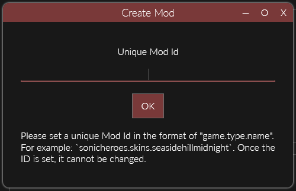
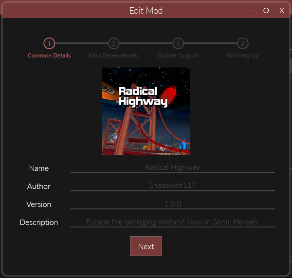
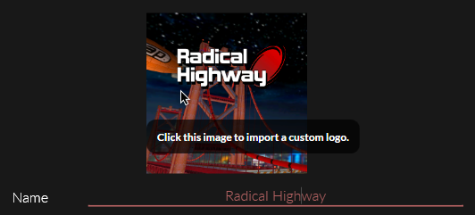
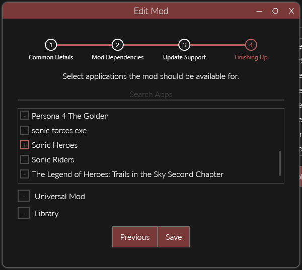
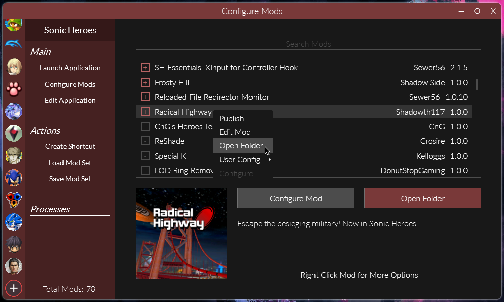

# Creating Mods

!!! note

    This section is for non-programmers wishing to create mods which take advantage of existing mods/plugins (such as file redirection).  
    If you intend on programming with Reloaded, please see [Programmers' Getting Started](./DevelopmentEnvironmentSetup.md) instead.  

## Create A Configuration File

The first step towards creating a mod is to make a configuration file.
This can be simply done by entering the `Manage Mods` (3 gears) menu and clicking the `New` button.

For the **Mod Id** you should enter a name that is unique to your mod.  

The format `game.type.name` is suggested, for example `sonicheroes.asset.seasidehillmidnight`.  

This name should be human readable.  

## Edit the Mod Configuration

!!! note

    You can access this menu in the future by selecting the mod and clicking `Edit` in the Manage Mods menu, or by right clicking the mod in any game's mod list.

### Main Mod Details

Set the following mod properties.  
- `Name:` The name of the mod a seen in the launcher.  
- `Author:` The name of the author(s) of the mod.  
- `Version:` The version of the mod.  
- `Description:` Short summary of the mod.  

For the `Version` field, Reloaded uses [Semantic Versioning](https://semver.org).  

In simple terms, please use the `X.Y.Z` format for your versions and increment:  
- `X` when you make big/breaking changes that fundamentally change your mod.  
(Example: Major game rebalance)  
- `Y` when you add new features without breaking existing functionality.  
(Example: Add stage to stage pack)  
- `Z` when you add new bug fixes.  
(Example: Fixed bad texture)  

### Update the Preview Image

To set the preview image, click on the image above the `Name` field.  

Although any resolution is accepted, it is recommended that your preview image is  `256x256` in size (or a multiple like `512x512`). This is the size it will be displayed at to most users.  

### Add Game Support to Mod

Select the game(s) you wish to support from the dropdown menu.  

This will make it so that your mod will be visible in that specific game's mod list.

## Summary

By the end of this guide, you should have a newly created mod, which will be visible in your game's mods list.  

Next: [Adding Mod Functionality](./AddingModFunctionality.md)  