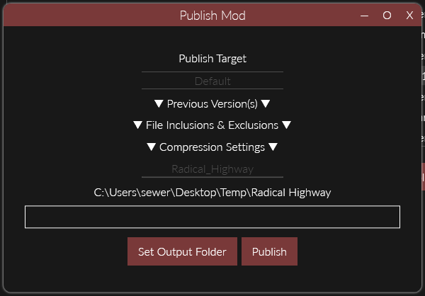
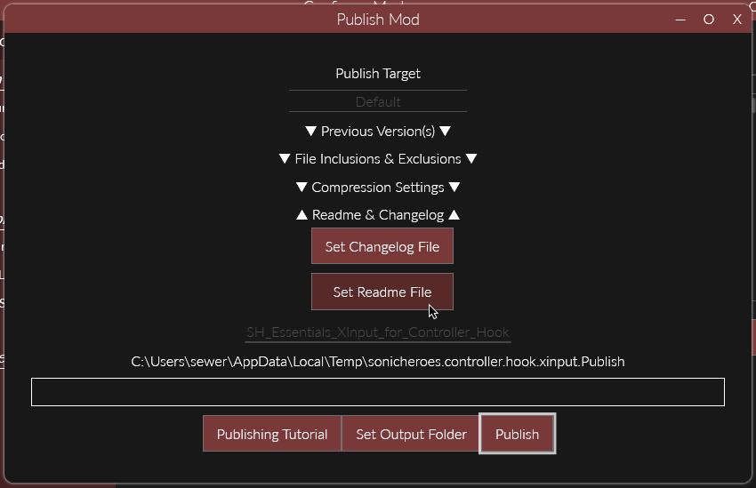
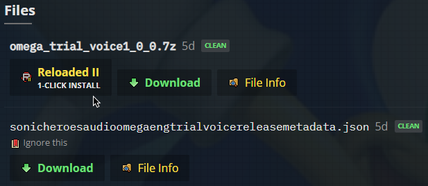

# Uploading Mods

!!! tip

    Before creating a Release, it is recommended you [Enable Update Support](./EnablingUpdateSupport.md) for your mod, 
    *even if you don't plan to ship updates*. Doing so will allow your mod to be included in [Mod Packs](./InstallingModPacks.md) [(How to Create Them)](./CreatingModPacks.md).  

Before uploading a mod, you should first create a `Release`.  

A `Release` consists of 2 files:  

- Compressed version of your mod.  
- JSON text file containing update information.  

## Note for Code Mods

!!! info

    If you're a programmer shipping a code mod with dependencies, do the following at least once:  
    - Build your mod (if needed).  
    - Restart the launcher.  
    - Copy `ModConfig.json` back from mod folder to your code project.  

This is important as [Reloaded copies update information from dependencies into your ModConfig](./Images/DependencyPropagation.png), allowing for automatic installation if the end user doesn't have the dependency.  

!!! note 
    
    GitHub has a low limit of 60 requests/hour per IP for unauthenticated users. This gets exhausted fast. If you're publishing a mod that is likely to be a dependency of another, it's recommended to have an alternative update source if possible.  

## Create a Release

In order to create a release for a mod, right click the mod and hit `Publish` in an individual application's main page.  

  

  

Select the `Publish Target` from the dropdown.  
(Use `Default` if your website/location is not present in the list.)

### Add a Changelog & Readme

!!! info "About Markdown"

    Reloaded uses Markdown [(tutorial)](https://commonmark.org/help/tutorial/index.html) for its text documents.  
    If you ever use *italics* and **bolds** in your Discord/Reddit posts, you're probably familiar with a small bit of Markdown.  
    Markdown files use the file extension `.md` and can be saved/opened with any text editor.  

!!! tip

    Markdown editors such as [Dilinger](https://dillinger.io) and [Typora](https://typora.io) allow you to preview your formatted text in real time.  

You can add changelogs and readme files during the publish step by clicking the `Set Readme File` and `Set Changelog File` buttons respectively.  

  

In the selection dialog, select the file (`.md`) containing the text to be included; e.g. `Readme.md` for the Readme and `Changelog.md` for the Changelog.  

!!! note

    GameBanana Descriptions and Updates are auto-converted to Readme and Changelogs.  
    If your mod page only hosts 1 mod; then it is acceptable to use those instead.  

### Add Delta Update

!!! info "About Delta Updates"

    Reloaded allows for the creation and usage of delta updates.  
    This is a special kind of update that allows the user to only download the code and data that has changed since the last version of your mod.  

!!! example

    If mod version `1.0.1` adds 8MB of files, the user will only download 8MB to update from last version (`1.0.0`), instead of the full mod. 

To create a delta update, do the following:  
- Download the previous version of your mod (including `.json` file!) to an new folder.  
- Check `Automatic Delta` in `Delta Update` tab.  
- `Set Output Folder` to the location of the new folder.  

!!! note

    If you have an unpacked version of your previous mod, i.e. as a raw folder; you can add that in the `Delta Update` tab manually instead.  

### Publish and Upload Your Mod

When you are done, click `Publish` and upload all of the `.7z` and `.json` files in the folder.  

## Summary

By the end of this guide, you should have successfully published your mod.  

  

If uploading to GameBanana (pictured above), a `1-Click Install` button should show up after 2-5 minutes.  

!!! tip

    You can make mods directly downloadable with 1 click by prefixing any `http(s)` link with `r2:`, e.g. [File Monitor 1 Click](r2:https://github.com/Reloaded-Project/reloaded.universal.redirector/releases/download/1.2.6/Reloaded.Universal.Monitor1.0.12.7z)

Additional (Optional) Resources:  
- [Missing 1 Click Install Button on GameBanana](./CreatingReleaseExtras.md#missing-1-click-install-on-gamebanana)  
- [Publishing Mods from Commandline](./CreatingReleaseExtras.md#publishing-mods-from-commandline)  
- [Publishing Mods to NuGet](./CreatingReleaseExtras.md#uploading-to-nuget)  
- [How Legacy Mods are Handled](./CreatingReleaseExtras.md#handling-legacy-mods)  