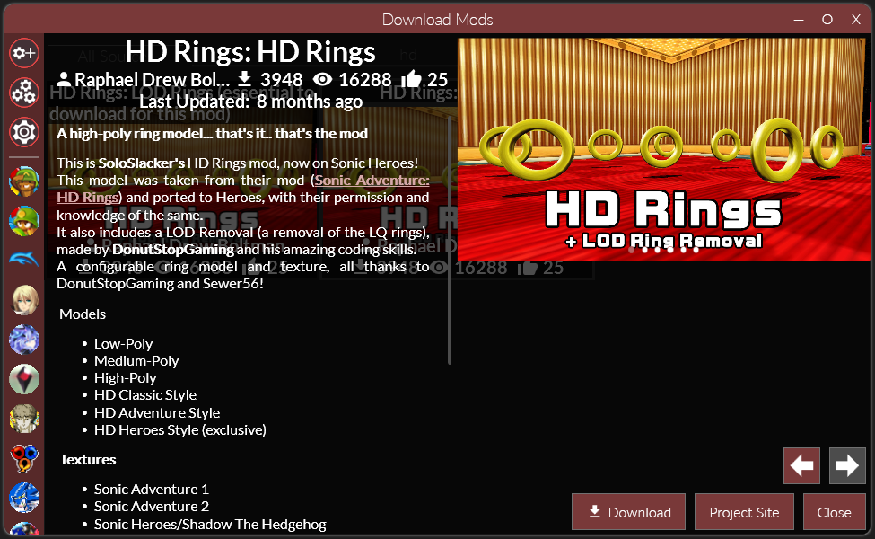

## Publishing Mods from Commandline

!!! note

    If you are making a code mod, it is recommended to use the Publish script from the [Mod Template](./ModTemplate.md).  

    The following instructions are provided for people wishing to make their own build scripts.  

Reloaded comes with a set of tools that can be used to create releases outside of the launcher.  

- `Reloaded.Publisher.exe` [Recommended]: Publishes a release for a mod. Identical features to GUI's `Publish Mod` menu.  
- `NuGetConverter.exe` [Legacy]: Automatically creates a NuGet package given a mod folder or a mod zip.  

You can get them from either of the 2 sources:  

- Via [GitHub Releases](https://github.com/Reloaded-Project/Reloaded-II/releases) (`Tools.zip`).  
- Via [Chocolatey](https://chocolatey.org/packages/reloaded-ii-tools).  

## Uploading to NuGet

When creating a release, please select the `NuGet` publish target. This should output a `.nupkg` file, which you will upload.  

The easiest way to upload a package is to install the [.NET SDK](https://dotnet.microsoft.com/download/dotnet/thank-you/sdk-5.0.101-windows-x64-installer) and use the `dotnet` commandline utility. 

Example:  
```
# Upload package.nupkg to the official Reloaded server.
dotnet nuget push -s http://packages.sewer56.moe:5000/v3/index.json -k API-KEY package.nupkg
```

[Upload instructions for the official Reloaded package server](http://packages.sewer56.moe:5000/upload).  

## Missing 1 Click Install on GameBanana

If a `One Click Install` button does not show up for your uploaded mod after 5 minutes; chances are that `1 Click Support` for Reloaded II is not enabled for this game.  
Contact [Tom @ GameBanana](https://gamebanana.com/members/1382) to ask for the button to be enabled.  

## Handling Legacy Mods

!!! info

    Reloaded tries to make the experience consistent, even with old mods that don't have a `.json` file with extra info.  
    When possible, Reloaded will try to guess unknown details such as readme, changelog and mod title automatically if they are not available.  
    
Here is an example:  



The description was automatically copied from GameBanana's description on their site:  


The mod name is a combination of the page name on GameBanana `HD Rings` and the description of the file `HD Rings`, hence `HD Rings: HD Rings`:  

