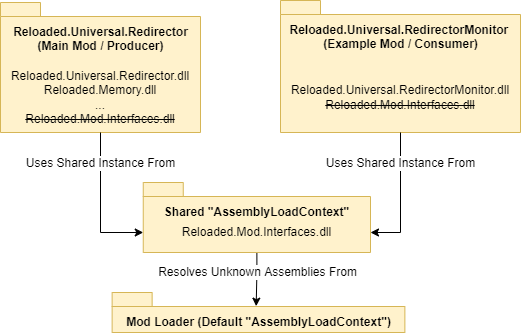

# How does it *Really* Work?

!!! info

    The following section describes the internal implementation detail of how
    dependency injection works. It is provided to those that are really interested.

Reloaded makes extensive use of [AssemblyLoadContext](https://docs.microsoft.com/en-us/dotnet/core/dependency-loading/understanding-assemblyloadcontext)(s) to provide isolation between mods, such that they may use 3rd library plugins and dependencies of their choice without interfering with other mods. This can make it difficult to share state between a mod and the loader, and even more so between individual mods.  

Reloaded overcomes this challenge by sharing instances of `Assemblies` (DLLs), loosening up isolation around shared code. Mods can nominate which `Assemblies` they wish to share with other mods, and the loader will load them into a shared `AssemblyLoadContext`. When the mod is loaded, the Mod Loader will then force it use the shared `Assembly` instances from the shared `AssemblyLoadContext`.  

For publishers its own shared types are automatically shared with itself, for consumers this is determined using the `ModDependencies` field in `ModConfig.json`.  
  

## How is this arrangement Setup?

The whole process for sharing an `Assembly` looks something like this: 

1. Gathering Dependencies  
    1. Mod Loader loads `Redirector` (Publisher).  
    2. Mod Loader loads all shared Assemblies into Shared `AssemblyLoadContext`  
    3. Mod Loader unloads `Redirector` (Publisher).  

2. Loading Mods  
    1. Mod Loader loads `Redirector`, sharing its own `Assemblies` with itself (from 1.b).  
    2. Mod Loader loads `RedirectorMonitor` (Consumer).  
        1. `RedirectorMonitor` specified `Redirector` in its `ModDependencies` field.  
        2. Therefore Mod Loader shares all of `Redirector`'s exports with `RedirectorMonitor`.  
        
3. Executing Mods  
    1. Mod Loader rearranges mod load order to account for mod dependencies.  
    1. `Redirector` code executes. Redirector publishes `IRedirectorController` (from Reloaded.Mod.Interfaces.IRedirector.dll) to Mod Loader.  
    2. `Monitor` code executes. Monitor obtains `IRedirectorController` from Mod Loader.  