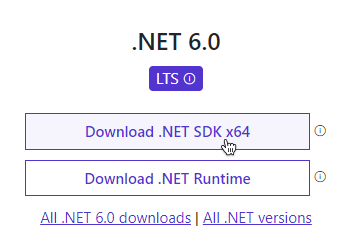

# Development Environment Setup

To start developing mods with Reloaded, you will need the following:

- [Latest .NET SDK](https://dotnet.microsoft.com/en-us/download)  
- Integrated Development Environment (IDE)  
- Reloaded Mod Template  

More details below.  
You should also run `Reloaded` at least once before starting to develop mods.  

## .NET SDK

To install .NET SDK, do the following:  
- [Visit .NET Download Page](https://dotnet.microsoft.com/en-us/download).  
- Download and Install the Latest .NET SDK for your OS.  



To verify that the SDK is correctly installed, open up a `command prompt` and run the following command: 

```
dotnet --list-sdks
```

Assuming the SDK is installed correctly, the command should return at least 1 entry and its location. Example output: 

```
6.0.300 [C:\Program Files\dotnet\sdk]
```

## Integrated Development Environment (IDE)  

The most common IDEs and code editors used with .NET include the following:  

- [Visual Studio Community](https://visualstudio.microsoft.com/): Free. The .NET IDE pretty much everyone is familiar with. Windows only.  
- [JetBrains Rider](https://www.jetbrains.com/rider/): Paid. Good choice for those familiar with other JetBrains products like IntelliJ and PyCharm. Crossplatform.  
- [Visual Studio Code](https://code.visualstudio.com/): Free. Crossplatform, supports .NET via plugins.  

## Installing Reloaded Mod Template

Reloaded provides a template to allow for a quick start with mod development.  

To install the template, run the following command:  
```
dotnet new -i Reloaded.Mod.Templates
```

Once installation is complete, you should see a dialog that looks like this upon success:  

```
Template Name             Short Name  Language  Tags
------------------------  ----------  --------  --------------------
Reloaded II Mod Template  reloaded    [C#]      Common/Library/Games
```

## Summary

You are now ready to start developing mods with Reloaded.  
Next: [Creating a New Project](./ProjectSetup.md)  
