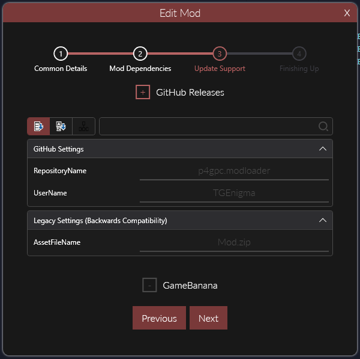
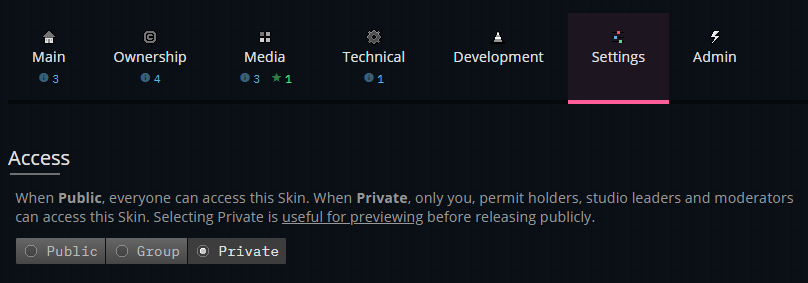
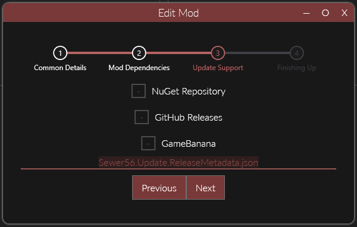

# Adding Update Support

Reloaded mods use *[Semantic Versioning 2.0](https://semver.org)* as the standard for version names.  Please use the `X.Y.Z` format for your mod versions, and/or any other format supported by semantic versioning.  

## Enabling Update Support  

In modern Reloaded, configurations for updates are part of the mod metadata `ModConfig.json`. These configurations can be easily edited using the `Edit Mod Menu`. 

You can find this menu in either  
- `Manage Mods` -> Highlight Mod -> `Edit Mod`  
or  
- `Game` -> Right Click Mod -> `Edit Mod`  

Hover your mouse over the text boxes for more information.  
Pre-releases are also supported, but must be explicitly enabled by the user (`Edit User Config` -> `Allow Beta Versions`).  

### GameBanana

To support updates from GameBanana, first upload your mod as a private submission  

Then copy the item ID from the URL of your mod page: 

Insert the number from the URL into the `ItemID` field in the mod configuration, and you are done.  
If you are publishing the mod from the GUI, please select the `GameBanana` option in the dropdown.  

### GitHub Releases

For GitHub Releases, tags are used to denote the current version of your mod:  

If the GitHub tag version is higher than the local one, there is an update.  

If you wish not to use tags [e.g. you have multiple mods in single GitHub Release], uncheck the `UseReleaseTags` box.

### NuGet 

For NuGet, you should specify the URL of the NuGet V3 server index where the mod should receive updates from. Any NuGet V3 feed is supported.  

Most common feed is the [official Reloaded NuGet Package Server](http://packages.sewer56.moe:5000) `http://packages.sewer56.moe:5000/v3/index.json` as it preconfigured in Reloaded's Launcher out of the box.

To add a server, right click the empty space beside `DefaultRepositoryUrls` and press `Add`, then click the newly created textbox to add an URL. 

## Publishing Multiple Mods

!!! note

    This section applies to mods made before June 2022.  
    Mods created using updated template or launcher should need no changes.  

In some scenarios you might want to prefer to publish multiple mods to a single GameBanana or GitHub page.  

In order to do this, you will need to rename the `Release Metadata` file in the Edit Mod menu such no 2 mods you will publish to the same page will use the same name.  

## Summary
Your mod should be ready for receiving in-launcher updates now.  

Next: [Creating a Release](./CreatingRelease.md)  