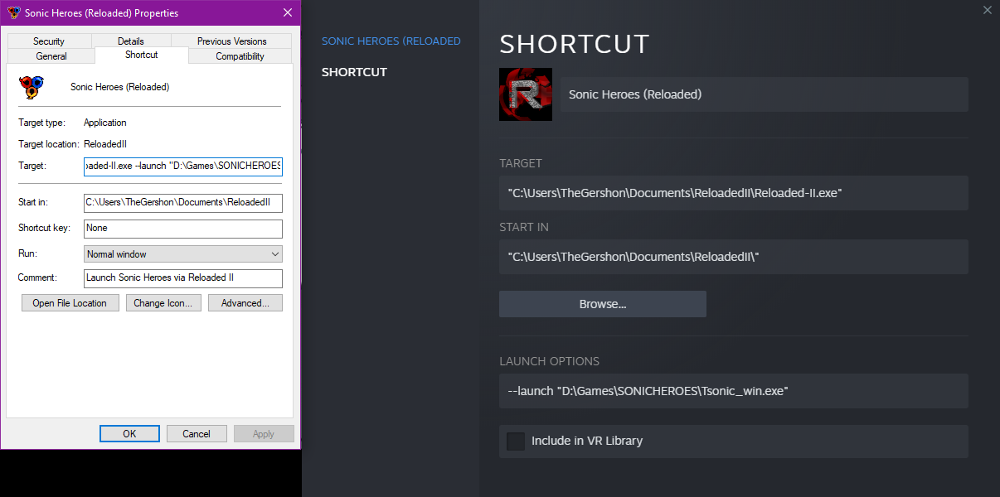

# Frequently Asked Questions

## What are the official download links for Reloaded?

The official downloads for Reloaded-II are on:

- *GitHub* [https://github.com/Reloaded-Project/Reloaded-II/releases](https://github.com/Reloaded-Project/Reloaded-II/releases)
- *GameBanana* [https://gamebanana.com/tools/6693](https://gamebanana.com/tools/6693)

Anything else is unofficial.

GitHub is always kept up to date while GameBanana is sometimes updated slightly less periodically. Regardless of what you download, the launcher will always offer to update itself to the latest up to date version.

## How do I get started with using Reloaded?

It's as easy as 1,2,3. [Take a look at the quick start guide!](./QuickStart.md)

## How do I report issues with Reloaded?

Please use the following link: [https://github.com/Reloaded-Project/Reloaded-II/issues](https://github.com/Reloaded-Project/Reloaded-II/issues)

## Can I use Reloaded with Steam Overlay/Controller Support?

There are multiple ways to do so, but the two recommended ones are:  

- Add Reloaded Shortcut to Steam  
- Load Reloaded via another code loader (e.g. Ultimate ASI Loader)  

=== "Adding Steam Shortcut (Recommended)"

    Create a shortcut from within the Reloaded Launcher and add it to Steam. 
    
    Right click the shortcuit and copy the entirety of the `--launch "PathToGame\Game.exe"` argument within the `Target` field into Steam's own `Launch Options` field.  

    Remember that the `--launch` argument comes **after** the path to your Reloaded-II installation, and not to include the preceeding space.  

    

=== "Installing ASI Loader (Alternative)"

    In your Mod Selection Menu, click `Edit Application` and expand the `Advanced` section.  
    Then simply press the `Deploy ASI Loader` button and voila!  

      

    If you are using Wine, [there is an extra step involved](./LinuxSetupGuide.md).  

## My controller does not work when using Reloaded

You're probably using an old style controller with a game that only supports Xbox-style (XInput) controllers.

Please see [issues/38](https://github.com/Reloaded-Project/Reloaded-II/issues/38) for more details and workarounds.

## Can I use Reloaded with Multiplayer Games?
Please don't, this isn't what Reloaded was built for and you'll most likely get banned if the game has a decent anticheat.

## How do I get started with making mods for Reloaded?

Getting started with making mods is very easy, you can in fact do it from inside the launcher itself!

[Follow this guide for an explanation of things](./CreatingMods.md). 

Before you get going, reach out and consult the community for your application! If they are already using Reloaded, they may have some fancy mods, tools, or both!

### How do I get started with programming mods for Reloaded?

As a programmer you should have an adequate level of self sufficiency. As such, please follow the following guide: [Building Mods](./DevelopmentEnvironmentSetup.md)

### How can I contribute to Reloaded?

The easiest way to contribute to Reloaded is to [look at the issue list on GitHub](https://github.com/Reloaded-Project/Reloaded-II/issues).

Anything labelled as `accepted` is up for grabs by anyone, unless assigned to a specific user.
Just make sure to follow the coding style in the existing projects and try to write good code. 
If the code isn't up to scruff, you might be asked to make changes.

Instructions for building Reloaded, and some of the details of its internal workings are also [available as part of the documentation](./index.md#reloaded-for-potential-contributors)

**Documentation, especially one that benefits the end user is just as valuable as any code.**

### I'm from a C/C++ background? Is there any way we can transfer our existing work?

Reloaded CAN load native DLLs, albeit with limited support. 
For more details please see: [Native Mods](./NativeMods.md)

If your mod was written with an ASI Loader in mind, it should work out of the box.
If your existing mod is tied with a specific mod loader (e.g. using some kind of loader API), you will need to find a way to replace this functionality.

Please note that config files may be dropped in game directory for mods originally meant for ASI loaders, unless the mod explicitly checks DLL directory; you might need to make minor changes to your mods to account for that.

You will still need to generate a mod configuration as per the guide.

## How can I Install Mods Manually?

To install mods manually, simply extract a downloaded `zip` or `7z` file to the `Mods` folder.  

  

If there is no single folder inside the downloaded mod, create one yourself.  