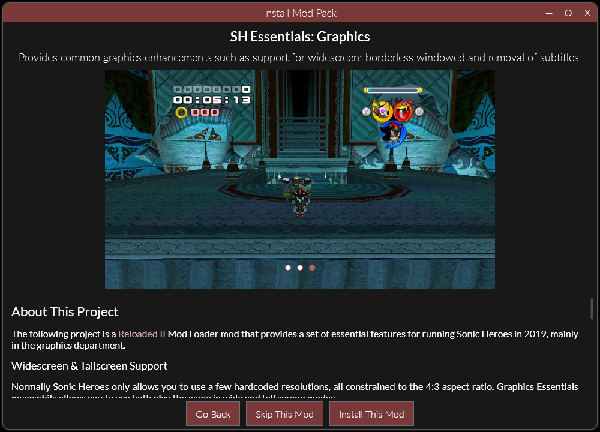
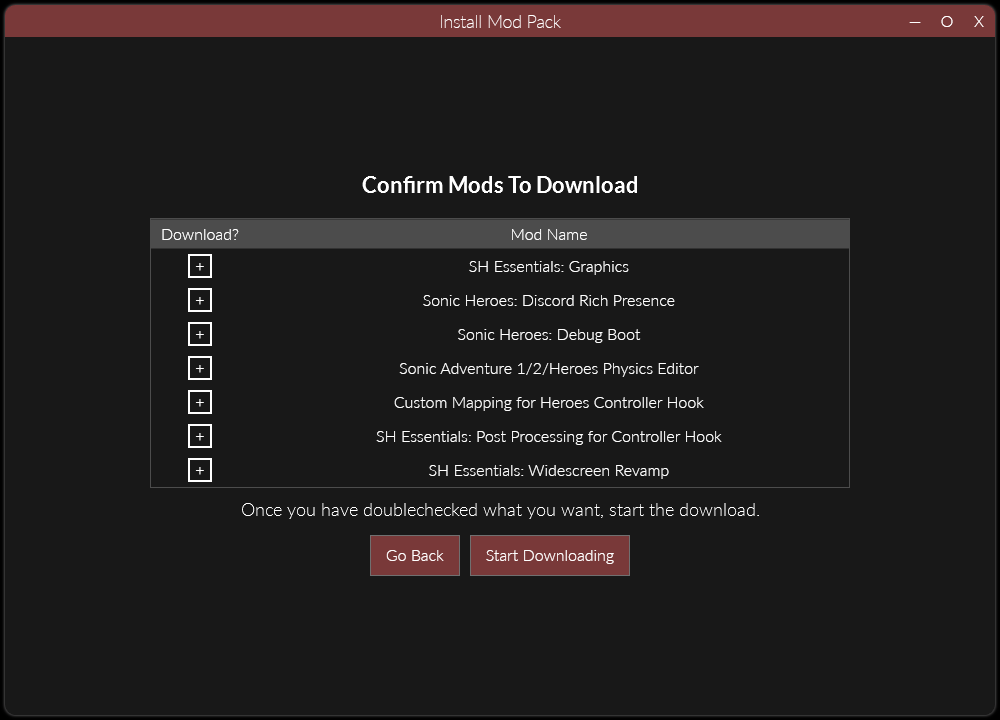

# Installing Mod Packs

Mod packs are a functionality which allows for fast installation of multiple mods at the same time. It is particularly helpful in helping new users get setup fast.  

If you wish to know how to create mod packs, please see [Creating Mod Packs](./CreatingModPacks.md).

## Installing From File

Downloaded mod packs use the `.r2file` extension and can be opened by directly doubleclicking from explorer. 

Once opened, the mod pack will greet you with a welcome screen:  

## Installing From Web Browser

Any download to an `.r2pack` file can be prefixed with `r2pack:`.  

For example, the link `https://website.com/Reloaded.r2pack` can be turned into `r2pack:https://website.com/Reloaded.r2pack`.  

When done inside a web browser, a prompt will appear to download and open the file with Reloaded.  

!!! note 

    If you have a very slow internet connection, very large packs might take a bit for the window to pop up; as it has to download the whole `.r2pack` file first, which contains all images.  

## The Complete Experience

!!! info

    Shows the step by step experience of a typical mod pack installation.

First appears the welcome screen:  

Then you select whether to install (or skip) each individual mod:  

And confirm which mods you want to download:  

The mods download while a slideshow is being presented:  

