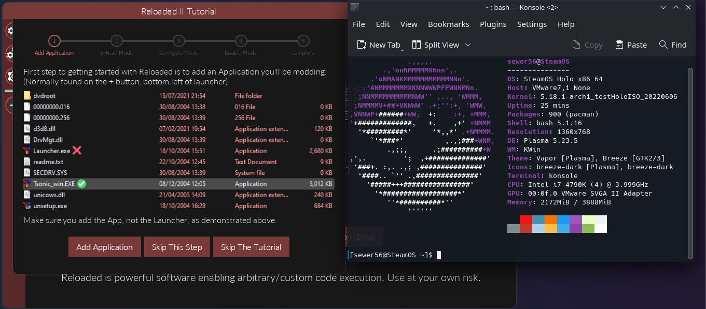
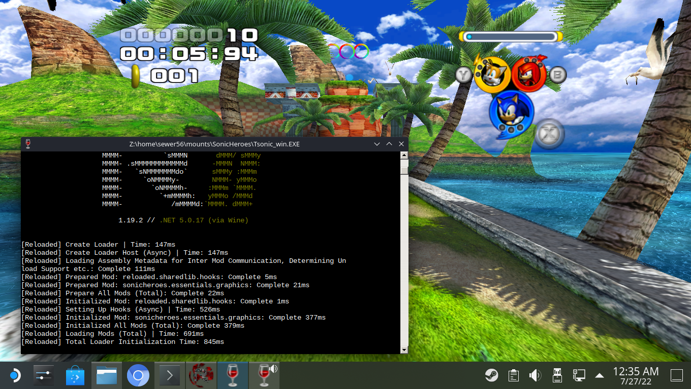
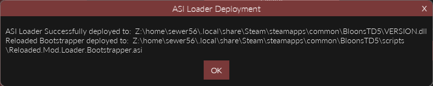
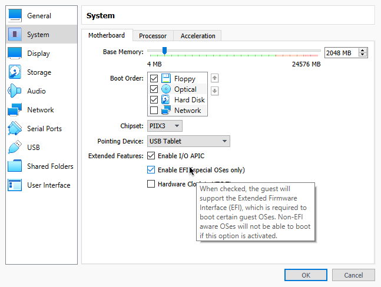

# Linux Setup Guide (Legacy)

!!! info "This is the *legacy* setup guide."

    This shows you how to run Reloaded in a setup that involves running the launcher via Wine
    and games via Wine/Proton. This is a bit more flexible but can be a hassle to set up.

    For a more streamlined guide, see [Linux Setup Guide (New)](LinuxSetupGuideNew.md).

!!! help "Help Needed"

    This documentation page could be improved, it only covers the barebones information.  
    Community contributions would be very welcome. 

## Wine

Open a `Terminal` window (Konsole, GNOME Terminal, Kitty etc.) and install `wine` & `winetricks`:  

| Distro                              | Command                               |
|-------------------------------------|---------------------------------------|
| Apt Based (Ubuntu, Debian etc.)     | `sudo apt install wine winetricks`    |
| Arch Based (Arch, SteamOS, Manjaro) | `sudo pacman -S wine winetricks`      |
| Fedora                              | `sudo dnf -y install wine winetricks` |

After installing wine, run `winetricks` from your terminal, we will install `.NET Framework`, which is used by the Reloaded installer.  

Run the following command:

```bash
winetricks dotnet48
```

You can then download the Reloaded Installer (`Setup.exe`) [from the downloads page](https://github.com/Reloaded-Project/Reloaded-II/releases/latest), and run it via Wine (doubleclick).  

!!! info

    The installer automatically installs Reloaded and dependencies for you.  
    If the window does not render; don't worry the installer will still automatically complete.  
    This process usually downloads ~120MB of data and takes 30-60 seconds for most people.  

!!! tip

    If the installer has issues, you can try running it without GUI `wine Setup.exe --nogui`.  
    
!!! note

    If you have the native version of .NET installed on your machine, it is possible that in some  
    cases the native version might be executed by Wine as opposed to the installed Windows version.  
    
    [Using `DOTNET_ROOT= wine Reloaded-II.exe` to run Reloaded might help.](https://github.com/Reloaded-Project/Reloaded-II/issues/148)

If install is successful, Reloaded's launcher will boot and a shortcut will be created on your desktop. If you cannot see it there, check Wine's Desktop folder (usually located in `<your_home_dir>/.wine/drive_c/users/<username>/Desktop/`).  



[Reloaded running on Modified SteamOS 3.0 (HoloISO), to simulate a Steam Deck]



### Finding (Steam) Games

!!! hint

    Wine by default hides files and folders that start with a dot; which might make it difficult to navigate to Steam games. To fix this, run `winecfg` (Wine Configuration) and check `Show dot files` in the `drives` tab.  

The easiest way to find your Steam games is simply right clicking the game, right click and clicking `Manage -> Browse local files`.  

Then when adding the game in Reloaded, go to the folder opened by Steam inside the file picker.   

### Using ASI Loader

!!! info

    You can launch Reloaded via the ASI Loader in the case that launching from Reloaded Launcher does not work.  
    This will make it so Reloaded gets loaded naturally as part of the game's boot process (i.e. it will be automatically loaded when you start the game from outside the launcher).

To do this, go to `Edit Application -> Advanced Tools & Options -> Deploy ASI Loader`.  



Note down the name of the non-Reloaded DLL that has been placed inside the installation directory. In this case the name is `VERSION.dll`.  

Then you will need to make sure that Wine will load this DLL; there is more than 1 way to achieve this:  

=== "Recommended Approach (Per-Application)"

    `WINEDLLOVERRIDES` lets you temporarily specify DLL overrides for a specific wine process. You can use it in the terminal as such: `WINEDLLOVERRIDES="version=n,b" wine BTD5-Win.exe`.  

    If you are using Steam to launch your games you can, Right Click Game in Library, `Properties` and in `Launch Options` add `WINEDLLOVERRIDES="version=n,b" %command%`.  

    

=== "Alternative Approach (More Permanent)"

    Alternatively, for a more permanent solution, you can run `winecfg` (Wine Configuration), navigate to `Libraries`, select the DLL in the `New override for library` box and click `Add`.  

    

Now Reloaded should automatically start with your game outside of the launcher.  

### Installing Reloaded Manually

!!! info

    If the installer does not work, or you wish to manually install Reloaded for any other reason, you can follow the instructions below.  

Download and extract `Release.zip` form Reloaded's Latest Release:  
- [Reloaded-II Release](https://github.com/Reloaded-Project/Reloaded-II/releases/latest)

Download and install the following in Wine:  
- Visual C++ 2015+ Runtime [x86](https://aka.ms/vs/17/release/vc_redist.x86.exe) AND [x64](https://aka.ms/vs/17/release/vc_redist.x64.exe).  
- .NET 5 Desktop Runtime [x86](https://dotnet.microsoft.com/en-us/download/dotnet/thank-you/runtime-desktop-5.0.17-windows-x86-installer) AND [x64](https://dotnet.microsoft.com/en-us/download/dotnet/thank-you/runtime-desktop-5.0.17-windows-x64-installer).  

You can now start Reloaded with `Reloaded-II.exe`.  

## Proton

!!! hint

    You should run the game via Proton (Steam) at least once before following this guide.  

!!! info

    The following instructions will allow you to setup Reloaded to run inside your game's Proton configuration.  
    This section assumes [you have already setup Reloaded using Wine](#wine).  

When you use Proton, Steam creates a 'clean slate' (`WINEPREFIX`) for each game; meaning that the dependencies for Reloaded wouldn't be installed when you run from Proton. We will use the Reloaded Installer (`Setup.exe`) to manually install the dependencies for Reloaded inside your game's WINEPREFIX and then setup Reloaded to run when you boot the game from Steam.  

Start by finding the *Steam App ID* of the game [e.g. `306020`]. The recommended way to do this is [protontricks](https://github.com/Matoking/protontricks) (`protontricks -l`). Alternatively, you can get this number by [searching your game on SteamDB](https://steamdb.info/search), [or by checking the store page](https://gaming.stackexchange.com/a/149839).  


Once you have the AppID, locate the `WINEPREFIX` for your game, it should be located in `/home/<YOUR_USERNAME>/.local/share/Steam/steamapps/compatdata/306020/pfx`.  

Run the following series of commands in your terminal, substituting the parts in `<brackets>`:  

```bash
## The path you located in the previous step.
export WINEPREFIX="/home/<YOUR_USERNAME>/.local/share/Steam/steamapps/compatdata/<APPID>/pfx"

## Run Reloaded Installer in 'Install Dependencies Only' mode.
wine Setup.exe --dependenciesOnly

## Create Symbolic Link for Mod Loader Settings.
ln -s "/home/<YOUR_USERNAME>/.wine/drive_c/users/<USERNAME>/AppData/Roaming/Reloaded-Mod-Loader-II" "/home/<YOUR_USERNAME>/.local/share/Steam/steamapps/compatdata/<APPID>/pfx/drive_c/users/steamuser/AppData/Roaming/Reloaded-Mod-Loader-II"
```

Once you are done, launch the Reloaded launcher and [Deploy ASI Loader](#using-asi-loader).  
If all goes well, you should be able to launch your game from Steam, running on Proton with Reloaded present.   

  

Example: Bloons TD5 running on Proton via Steam.

!!! warning

    Reloaded upgrades its .NET Runtime around once a year with, each release of the runtime.  
    When this happens, you will need to upgrade your runtime by running `Setup.exe --dependenciesonly` again.  
    Currently an upgrade to .NET 7 is expected on November 2022 Release.  

## Setting up a Virtual Machine Testing Environment

!!! info

    Following section of the guide is for setting up a SteamOS 3.0 (HoloISO) virtual machine.  
    Distro chosen due to popularity of the Steam Deck, it's currently at the time of writing the closest thing you can get to emulating a Deck user experience.  
    
    This is intended for people who wish to contribute to Reloaded, since testing with a VM can be faster.  

### VMWare Player

Open the `.vmx` configuration file for your virtual machine and add the following line.  

```bash
firmware="efi"
```

- Install HoloISO.  
- Chroot into install (desktop icon).  

```bash
## VMWare Stuff (optional)
pacman -S open-vm-tools nano 
systemctl enable vmtoolsd.service
systemctl enable vmware-vmblock-fuse.service
```

Once booted, to finish installation do the following:  
- In Settings -> Background services -> Disable KScreen 2, to be able to change resolution.  
- If you need copy/paste support, run `vmware-user &` in a terminal.  

### VirtualBox 

!!! warning

    VirtualBox is not recommended. Parts of Reloaded's launcher might not render.  
    This is a VBox specific issue; if you know a workaround, consider contributing to the wiki.  

- Enable EFI 




- Install HoloISO.  
- Chroot into install (desktop icon).  

```bash
## VirtualBox Stuff (optional)
pacman -S virtualbox-guest-utils
systemctl enable vboxservice 

## Force desktop environment
steamos-session-select plasma-persistent
```
