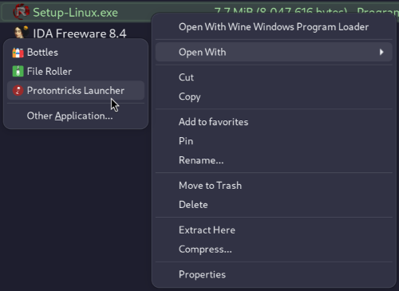
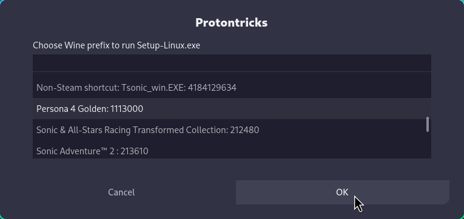
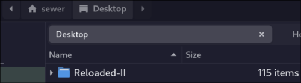
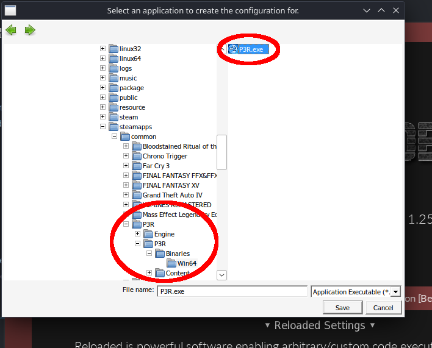

# Linux Setup Guide

!!! info "This is a streamlined guide for setting up a single game via Steam."

    This will help you install 1 instance of Reloaded per game.
    The steps try to be as minimal as possible.

    This is a generic guide for any game. For more specific info, consider looking up
    a ***game specific guide***.

## Install and Run your game via Steam

If you have a Steam game, install it and run it at least once.

If you have a non-Steam game, add it to the Steam launcher and launch it from Steam first.

!!! info "This is required for [Protontricks] to discover the game."

## Install Protontricks

If you are on a ***Steam Deck*** or have ***Flatpak*** pre-installed on your Linux distribution,
use the [Installing Protontricks via FlatPak][protontricks-flatpak] section.

Otherwise refer to the [Protontricks] documentation for installation info.

## Install Reloaded-II via Protontricks

Download [Setup-Linux.exe] (Direct Link) from Reloaded's releases section.

Then start it via Protontricks. ***Right-click*** the EXE in your file browser and select `Open with Protontricks Launcher`
from the context menu.

!!! note "You may need to look into the `Open With` menu."

And select your game from the list:

This will install to your desktop:

You can then start the game via the shortcut on your desktop, or from the start menu.

!!! note "The Linux installer does not have a GUI"

    Installation may take a minute, please be patient.

    As an approximation, the installer will download 140MB of files, install 4 runtimes and Reloaded.
    This usually takes 10-30 seconds and is mostly dependent on internet speed.

## Add a Game

!!! info "Add your game to Steam"

- For most Steam installs this will be `Z:\home\<your_username>\.local\share\Steam\steamapps\common\<gamefolder>`.
- For ***Steam Deck*** users with game installed in SDCard this may be `E:\steamapps\common\<gamefolder>`.

## Launching Reloaded-II

Installing via `Protontricks` should have created a shortcut on your desktop.
Provided you don't move the game folder or Reloaded folder, this shortcut should 'just work'.

You are done. See [Quick Start] for further 'Getting Started' steps.

## [Optional] Starting Reloaded with your Game via Steam

If you wish to auto-inject Reloaded while starting your game via Steam without
having to go through the launcher, try using the [Using ASI Loader](./LinuxSetupGuide.md#using-asi-loader) step of the legacy setup guide.

-----------------------------

## Notes

!!! note "You can install Reloaded-II via regular `Wine`"

    However it's recommended you install via [Protontricks] if you plan to run your
    game via Proton. It will make your life much easier; as installing in Wine and running
    via Proton involves additional steps, outlined in the [Legacy Install Guide](./LinuxSetupGuide.md).

## Credits

- `Deck Screenshots`: [rudiger]

[rudiger]: https://x.com/rudiger__tw
[Protontricks]: https://github.com/Matoking/protontricks
[Setup-Linux.exe]: https://github.com/Reloaded-Project/Reloaded-II/releases/latest/download/Setup-Linux.exe
[protontricks-flatpak]: ./LinuxSetupGuideNewExtra.md#installing-protontricks-via-flatpak
[Quick Start]: ./QuickStart.md
