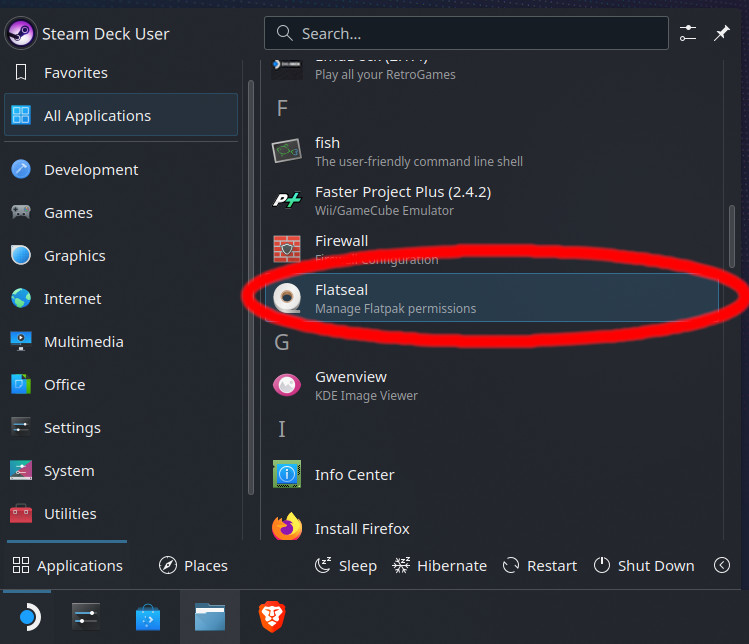
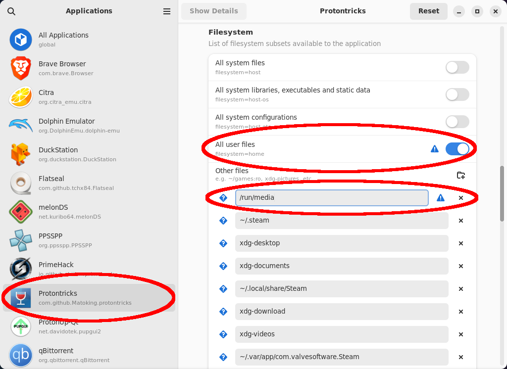

# Extra

!!! info "This guide contains extra tips for setting up Reloaded on Linux."

## Installing Protontricks via FlatPak

!!! info "Includes any distribution where FlatPak is available."

To insall Protontricks via FlatPak, we will need [Flatseal] and [Protontricks].

- [Flatseal] will allow the sandboxed [Protontricks] to see alternative Steam library locations.
- [Protontricks] will let you run Reloaded inside the game's sandbox.

These can be installed via a FlatPak supporting Package Manager such as [Discover]:


After installing, first launch [Flatseal]:



Scroll through the left column of apps in [Flatseal] until you're able to find and click on "[Protontricks]". This will display a configuration list in the right pane:



Scroll down to the "Filesystem" section:

1. Enable `All user files`.
2. Under `Other files`, add a new entry for "/run/media".
    - And any other locations you may have Steam titles installed.

Close Flatseal.

Lastly add an alias so `protontricks` can be executed from the terminal:

```bash
echo "alias protontricks='flatpak run com.github.Matoking.protontricks'" >> ~/.bashrc
echo "alias protontricks-launch='flatpak run --command=protontricks-launch com.github.Matoking.protontricks'" >> ~/.bashrc
```

Paste these lines into a `terminal` window, and press `enter`.

## Credits

- `Deck Screenshots`: [rudiger]

[rudiger]: https://x.com/rudiger__tw
[Discover]: https://apps.kde.org/en-gb/discover/
[Flatseal]: https://github.com/tchx84/Flatseal
[Protontricks]: https://github.com/Matoking/protontricks
[Setup-Linux.exe]: https://github.com/Reloaded-Project/Reloaded-II/releases/latest/download/Setup-Linux.exe
