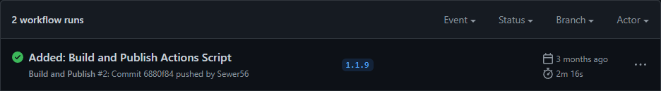
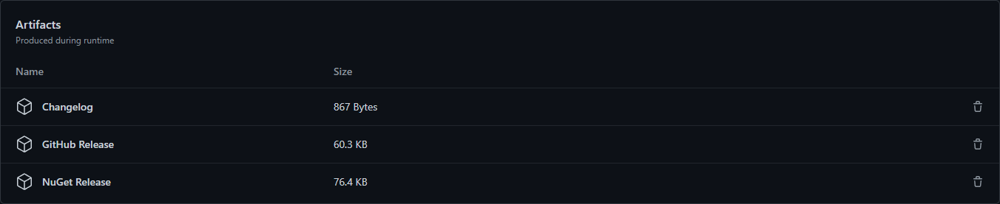
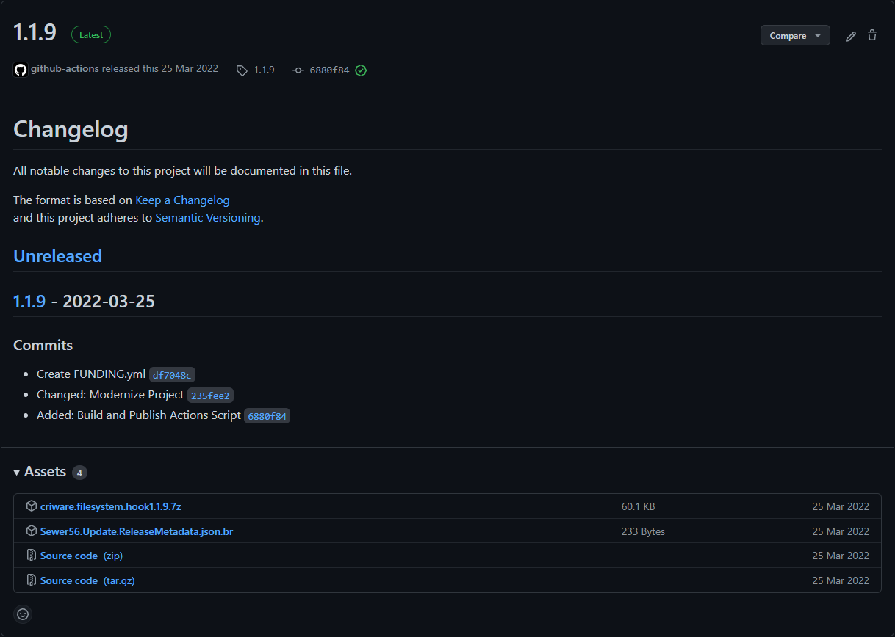

# Mod Template Features

!!! tip

    Some features are only available on newer versions of the template.  
    
## Publish Script

This template features a built-in publish script that can be used to create releases of your mod.  

To run it, open a Powershell prompt in your mod folder and execute the script as such:  
```powershell
.\Publish.ps1
```

Once the script completes, ready to upload packages will be output to the `Publish/ToUpload`.  

For extended help with the script and examples, consider running:  
```powershell
Get-Help .\Publish.ps1 -Detailed
```

### Delta Updates

Reloaded allows for the creation and usage of delta updates.

A delta update is an update that only requires the user to download the code and data that has changed, not the whole mod all over. It significantly saves on time and bandwidth usage.

```powershell
# Publish using GitHub Releases as the delta source.
./Publish.ps1 -MakeDelta true -UseGitHubDelta true -GitHubUserName Sewer56 -GitHubRepoName Reloaded.SharedLib.Hooks.ReloadedII -GitHubFallbackPattern reloaded.sharedlib.hooks.zip
```

```powershell
# Publish using NuGet as the delta source.
./Publish.ps1 -MakeDelta true -UseNuGetDelta true -NuGetPackageId reloaded.sharedlib.hooks -NuGetFeedUrl http://packages.sewer56.moe:5000/v3/index.json
```

See [Delta Updates](./CreatingRelease.md#add-delta-update) on more information about the topic.

### Publishing as ReadyToRun

!!! note 

    Using ReadyToRun is incompatible with unloadable mods due to a runtime limitation.  
    If you are using ReadyToRun, you should return `false` in `CanUnload()`.

If your mod has a lot of code that is executed at startup, consider using `ReadyToRun` in order to reduce the startup time.  

To use `ReadyToRun` set the `BuildR2R` flag to true when using the build script.  

```powershell
.\Publish.ps1 -BuildR2R true
```

R2R is a new type of officially supported file format, which gives a considerable improvement to startup times by shipping native code alongside standard .NET IL code; at the expense of assembly (DLL) size.  

You can read more about R2R in the following web resources:

- [Conversation about ReadyToRun](https://devblogs.microsoft.com/dotnet/conversation-about-ready-to-run/)  
- [ReadyToRun Compilation](https://docs.microsoft.com/en-us/dotnet/core/deploying/ready-to-run)  

## Assembly Trimming Support  

!!! note

    Trimming framework-dependent code is *not an officially supported .NET feature*.  
    Trimming in Reloaded is a custom feature that uses existing .NET SDK components under the hood.  

!!! danger

    Incorrect use of trimming *can* and *will* break your mods. When using trimming you should test your mods thoroughly.  

!!! warning

    You may need to add [Microsoft.NET.ILLink.Tasks](https://www.nuget.org/packages/Microsoft.NET.ILLink.Tasks) for this to work when running .NET SDK 8 or newer.  

*Assembly trimming* allows you to remove unused code from your mods (and their dependencies), often significantly shrinking the size of the generated DLLs. This in turn improves load times, download size and runtime memory use. At the time of writing, the Reloaded Loader itself and most official & creator made mods use trimming.

### Testing Trimming

Testing trimming is performed with included `BuildLinked.ps1` in the mod template.  
This script will fully wipe the mod output folder and build with trimming.  
When the build is done, go test your mod.  

Sample output:  
```
Input Assembly: Reloaded.Hooks.Definitions [Mode: link]
Input Assembly: Reloaded.Mod.Interfaces [Mode: link]
Input Assembly: Reloaded.Hooks.ReloadedII.Interfaces [Mode: link]
Input Assembly: Reloaded.Mod.Template [Mode: link]
```

`link` indicates the assembly is being trimmed.  
`` (empty) means trim if `IsTrimmable` == true, else use default trimmer setting [copy].  

### Configuring Trimming

Trimming can be configured by modifying your `.csproj` file. The following properties can be used to control the trimming process.  

| Reloaded Property      | Purpose                                                    | Replacement for.      |
|------------------------|------------------------------------------------------------|-----------------------|
| ReloadedILLink         | Enables trimming at publish time.                          | PublishTrimmed        |
| ReloadedLinkRoots      | Specifies a DLL/Assembly to be preserved in its entirety.  | TrimmerRootAssembly   |
| ReloadedLinkAssemblies | Specifies a DLL/Assembly to be force trimmed.              | ManagedAssemblyToLink |

Other officially supported properties can be used. For example you could supply an [XML Root Descriptor](https://github.com/dotnet/linker/blob/main/docs/data-formats.md#descriptor-format) with `TrimmerRootDescriptor` for more granular control.  

### Default Trimming Behaviour

The default trimming behaviour used in Reloaded mods replicates the behaviour from .NET 6 (not .NET 7+).  
The following general rules apply:  

- Only assemblies marked `IsTrimmable` are trimmed by default.  
- Default trimming mode (`TrimMode`) is `link` (remove unused assemblies + code).  

### General Trimming Guidance

!!! tip

    This is general guidance from personal experience with developing Reloaded.  

Doing the following steps is advised for enabling trimming:  

- Build with `BuildLinked.ps1`.  
- Add all assemblies with trim warnings to `ReloadedLinkAssemblies`.  
- Build again and test.  

!!! note

    If you have marked an assembly to not be trimmed with `ReloadedLinkAssemblies`, but it still displays a trim warning, feel free to ignore the warning.

Basic trimming now works. 

#### Trimming the Remainder

To further optimise your mod, you can now force trimming on individual libraries.  
To do so, perform the following.  

- Inspect the build output:  
```
# Sample Output
Input Assembly: Reloaded.Hooks.Definitions [Mode: link]
Input Assembly: Reloaded.Mod.Interfaces [Mode: link]
Input Assembly: Deez.Nutz.Library [Mode: copy]
```

- For each library where `Mode != link`.  
  - Enable trimming for library (using `ReloadedLinkAssemblies`).  
  - Build and test the mod.  
  - If the mod does not run correctly, remove library from `ReloadedLinkAssemblies`.  

## Automated Builds  

If you are using `GitHub` to host your project, the mod template contains a script for automatically building and uploading your mod for others to download.  

It has the following features:  
- Automatically build mod for `GameBanana`, `GitHub` & `NuGet`.  
- Automatically create changelog (using `git` commits).  
- Automatically upload your mod on tags (releases).  
    - Creates GitHub Release.  
    - Uploads to NuGet (if configured).  
    - If configured correctly, end users will automatically receive update.  

You can find and/or modify the script at `.github/workflows/reloaded.yml`.  

### Accessing Build Results

To access your automated builds, click the `Actions` button, select the latest ran `workflow` and scroll down until you see the `Artifacts` section.  

  
  
  

Please note the `Artifacts` have a limited lifespan, usually GitHub deletes them after around 30 days.  

### Automatic Publishing

In order to publish (upload) your mod, simply push a `tag` to the remote GitHub repository.  When the automated build finishes, the script will create a GitHub release and upload the mod to NuGet (if configured).

Example of an automated release:  

  

#### Publishing to NuGet

Publishing to NuGet requires additional configuration.  
- Set a NuGet Feed URL  
- Set a NuGet API Key

To set the NuGet feed, open `workflows/reloaded.yml` and change the `NUGET_URL` variable. The default is `http://packages.sewer56.moe:5000/v3/index.json` in which points to the official [Reloaded II NuGet repository](http://packages.sewer56.moe:5000).  

To set the API Key, add a [Secret](https://docs.github.com/en/actions/security-guides/encrypted-secrets#creating-encrypted-secrets-for-a-repository) named `RELOADED_NUGET_KEY`.  

### Multiple Mods Per Repository

If you want to use the same repository for multiple mods, it is recommended you create a `PublishAll.ps1` that runs the publish script multiple times with different parameters.  

Here is an example:  

```powershell
# Set Working Directory
Split-Path $MyInvocation.MyCommand.Path | Push-Location
[Environment]::CurrentDirectory = $PWD

./Publish.ps1 -ProjectPath "Reloaded.Universal.Redirector/Reloaded.Universal.Redirector.csproj" `
              -PackageName "Reloaded.Universal.Redirector" `
              -PublishOutputDir "Publish/ToUpload/Redirector" 

./Publish.ps1 -ProjectPath "Reloaded.Universal.Monitor/Reloaded.Universal.Monitor.csproj" `
              -PackageName "Reloaded.Universal.Monitor" `
              -PublishOutputDir "Publish/ToUpload/Monitor" 

./Publish.ps1 -ProjectPath "Reloaded.Universal.RedirectorMonitor/Reloaded.Universal.RedirectorMonitor.csproj" `
              -PackageName "Reloaded.Universal.RedirectorMonitor" `
              -PublishOutputDir "Publish/ToUpload/RedirectorMonitor" 

# Restore Working Directory  
Pop-Location
```

Then modify `workflows/reloaded.yml` to call `PublishAll.ps1` script instead of `Publish.ps1` script.  

Example repositories with this setup:  
- [Reloaded.Universal.Redirector](https://github.com/Reloaded-Project/reloaded.universal.redirector)  
- [Heroes.Controller.Hook](https://github.com/Sewer56/Heroes.Controller.Hook.ReloadedII)  
- [Riders.Controller.Hook](https://github.com/Sewer56/Riders.Controller.Hook)  

## Updating the Mod Template

!!! tip

    To update the template, you can run the command [dotnet new update](https://docs.microsoft.com/en-us/dotnet/core/tools/dotnet-new-update).  

!!! info

    If your mod was created using a template older than August 2022, [consider using the following guidance.] (#updating-from-old-template-layout).  

To update the mod template, do the following actions:  
- Create a new dummy mod (using the same project name as your existing mod).  
- Copy all files that aren't `Mod.cs` and `Config.json` to your existing mod.  
- Update `Reloaded.Mod.Interfaces` NuGet Package.  
- [Optional] Look inside `ModConfig.json` and `.csproj` for new fields/properties (for example, `ProjectUrl` was added in August 2022). 

You are done. 

### Updating from Old Template Layout

!!! info

    Older versions of the mod template (pre Sep. 2022) encouraged editing of the template directly, newer templates take a different approach. Templates can now be swapped out and new features can be applied in `Mod.cs` and `Config.cs`.  
    While not exhaustive, the following guidance can be used to help migrate to the new template format.  

#### Check Default IMod (Program.cs) Settings

!!! info

    Older versions of the mod template (pre Sep. 2022) encouraged editing of the template directly, newer templates take a different approach. Templates can now be swapped out and new features can be applied in `Mod.cs` and `Config.cs`.  
    While not exhaustive, the following guidance can be used to help migrate to the new template format.  

Old Defaults:  
- `CanSuspend`: false  
- `CanUnload`: false  
- `Suspend()`, `Unload()`, `Resume()`, `Disposing()`: Empty.  
- `OnConfigurationUpdated()`: Prints to console and assigns to field.  

If any of these are non-default in the old `IMod` implementation (`Program.cs`), you should move the non-default values to `Mod.cs` in the new template.  
Mod.cs inherits from `ModBase` which exposes the old methods as overridable virtual functions.  

```csharp
// Add to Mod.cs to override old CanSuspend.
public override bool CanSuspend() => true;
```

#### Move User Code from IMod (Program.cs)

The old layout suggested placing custom code under the line which reads:  

```csharp
// Please put your mod code (in the class) below
```

If you encounter this line, move the code below this line into the constructor of `Mod.cs` in the new template.  

### Configuration Migration

!!! info

    If your mod was created before 2022, you will need to migrate where your configurations are stored when using the newer templates.

Previously mods would store configurations in their own folders, however in newer versions a separate dedicated folder is now used.  
(You can find it in a mod's right click menu in the launcher).  

To migrate your configurations, locate the `ConfiguratorMixin` class (usually in `Config.cs`), and add the following method.

```csharp
public override void Migrate(string oldDirectory, string newDirectory)
{
    // Replace Config.json with your original config file name.
    TryMoveFile("Config.json");

#pragma warning disable CS8321
    void TryMoveFile(string fileName)
    {
        try { File.Move(Path.Combine(oldDirectory, fileName), Path.Combine(newDirectory, fileName)); }
        catch (Exception) { /* Ignored */ }
    }
#pragma warning restore CS8321
}
```

This process can also be used to handle migration for other config modifications such as when `TryRunCustomConfiguration() == true`.  
