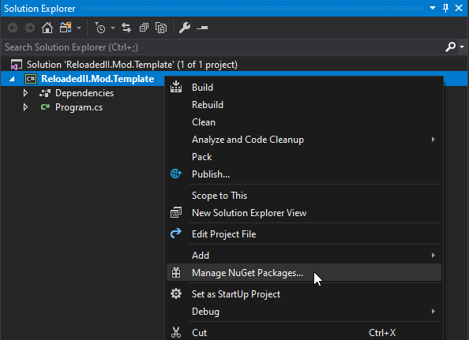
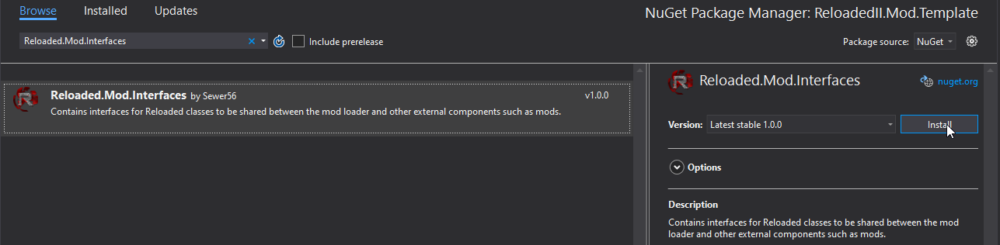
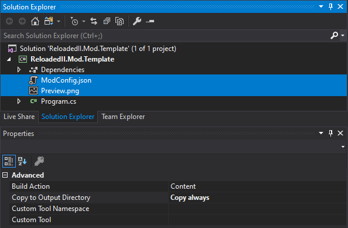

# Notice

This guide is a bit dated, however should still be relevant to modern Reloaded versions.

## Create a new .NET Project


Recommended to target the same version of .NET as used by the loader.  
*Do not* use a version of .NET newer than the loader.  

## Add the `Reloaded.Mod.Interfaces` NuGet package.




## Implement the `IMod` Interface.


## Create A Blank Mod in Reloaded. Copy Configuration & Preview Image.




Set their `Build Action` to Content + Copy Always.

## Unload Project and Add Two Properties in .csproj


```xml
<AppendTargetFrameworkToOutputPath>false</AppendTargetFrameworkToOutputPath>
<CopyLocalLockFileAssemblies>true</CopyLocalLockFileAssemblies>
```

