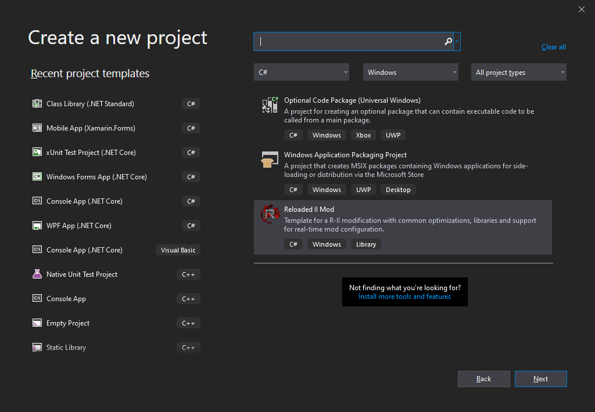
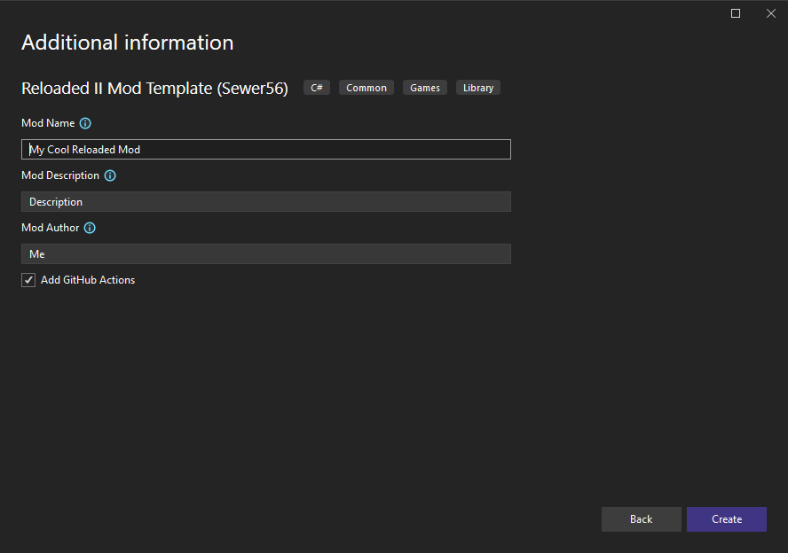

# Project Setup

Once the required tools are installed, you can now begin developing your mod.  

## Creating Your Project

Below is information on how to create a new Reloaded project.  
Once you create your project, you'll be able to open the `.csproj` file in your preferred IDE of choice. (or the folder where it is contained)

### From a Supported IDE

Some IDEs such as Visual Studio and JetBrains Rider allow you to create a new project directly from IDE.

  
  

### From the Command Line

Alternatively, you may create a project from the commandline.  
Navigate to an empty folder and run the following command.  

```
dotnet new reloaded -n <NAMESPACE> --ModName <MOD_NAME> --ModAuthor <MOD_AUTHOR> 
```

Replace `<NAMESPACE>` with your desired name of your project, `<MOD_NAME>` with the name of the mod as shown to the end user and `<MOD_AUTHOR>` with your own name.

For extended information on other options you can also run:  
```
dotnet new reloaded --help
```

## Mod Structure
Reloaded Projects compose of the following structure:
- Metadata File (`ModConfig.json`)
- Project Configuration (`.csproj`)
- Preview Icon (`Preview.png`)
- Your Mod Code (`Program.cs`, `Mod.cs`)

The metadata file contains essential information 

### Metadata File (ModConfig.json)

The metadata file contains essential information such as mod author, name, description, and supported applications.  

Example `ModConfig.json`:  


Common Fields:  
- `ModId`: A name that uniquely identifies your mod.  
- `ModName`: The name of your mod.  
- `ModAuthor`: The author of your mod.  
- `ModDescription`: A description of your mod.  
- `SupportedAppId`: Applications for which the mod should be enabled for by default. Uses lower case exe name.  

It is recommended to use the format `game.type.name` for `ModId` (e.g. `sonicheroes.asset.seasidehillmidnight`). `ModId` should also be human readable. **Once you release your mod, do not change ModId!!**.  

The recommended method of editing the metadata file is:  
- Build your mod (see below).  
- Editing the config from the `Reloaded Launcher`  
    - `Manage Mods` -> Select Your Mod -> Click `Edit Mod`  
- Copying the modified `ModConfig.json` file back to your project.  

## Building Your Mod

If you are using an IDE such as Visual Studio, simply build your project. (`Build->Build Solution`).  

If you are using the command-line you can build using the following command 
```
dotnet build
```

The mod will automatically be copied to your Reloaded-II's `Mods` folder, as long as Reloaded has not been moved since it was last launched.  

## Debugging Your Mod

Enable the mod and run the game via Reloaded.  

If you have built your mod in `Debug` configuration and a supported IDE/Debugger installed, you should automatically receive a debug prompt like the following when running your game/application.   
 
  

Select your IDE/Debugger of choice and have fun.  