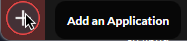
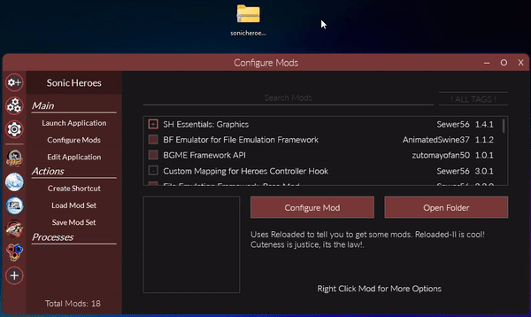
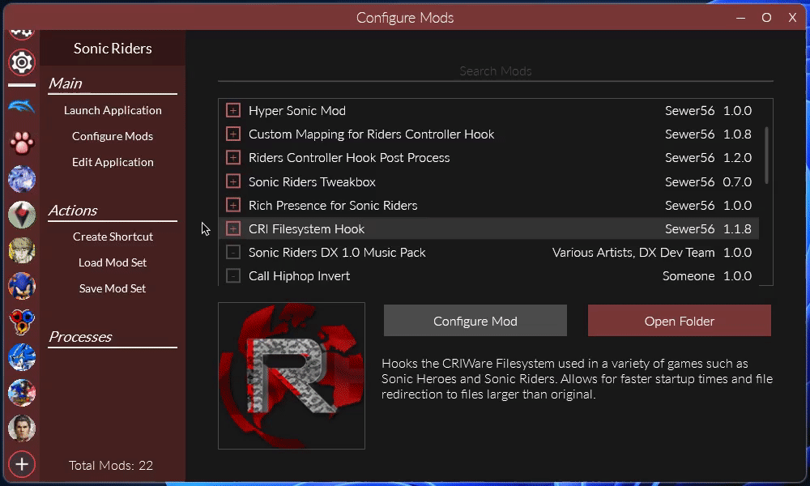

# Quick Start

## Add an Application
First step to getting started with Reloaded is to add an Application you'll be modifying.  
This can be found on the bottom left corner of the launcher, with the `+` button.  

Make sure to add the App and not the app's launcher.

## Install a Mod

Mods can be installed by dragging them over the Reloaded window.

If this doesn't work for you, you can also [install them manually](./FAQ.md#how-can-i-install-mods-manually).

## Configure Mods

Some mods might support additional configuration, allowing you to tweak things.  

  

If the "Configure Mod" is red when the mod is highlighted, the mod can be configured.

## Enable Mods

To enable mods, simply press the square checkbox.

  

A mod is enabled if the checkbox is red, disabled if it is grey.  
Once you are done, press `Launch Application`.  

----------
***Note***

Reloaded uses `.exe` name to determine which mods should automatically be assigned to an application.

If a mod does not show in the application, click the 3 gear button (`Manage Mods`).
From there, select the mod that you have just extracted from the list and check your game on the list below.
