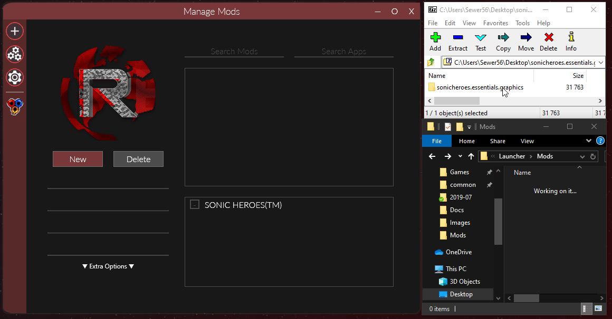
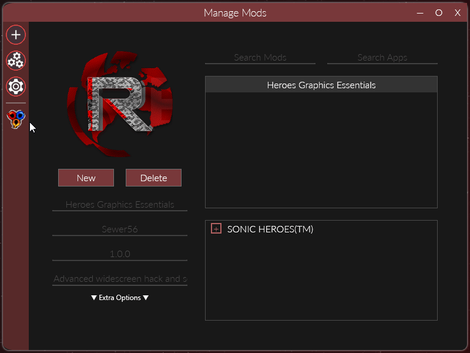

# Quick Start

## Add an Application
To add an application such as a game, simply click the plus button on the top of the sidebar `Add an Application`. Inside the menu, click new and select an application to make a profile for:

Make sure to add the game and not the game's launcher.

## Download Mods and Unhide
To add mods to Reloaded, simply copy/extract them to the `Mods` directory where you have launched the application from. 

If the mod download doesn't contain a directory in the zip/7z/rar file, create a new folder yourself.

## Enable Mod and Launch Application
From there, simply enter the `Application Menu`, enable the mod and launch the application. 

### Note
Reloaded uses `.exe` name to determine which mods should automatically be assigned to an application.

If a mod does not show in the application, click the 3 gear button (`Manage Mods`).
From there, select the mod that you have just extracted from the list and check your game on the list below.
