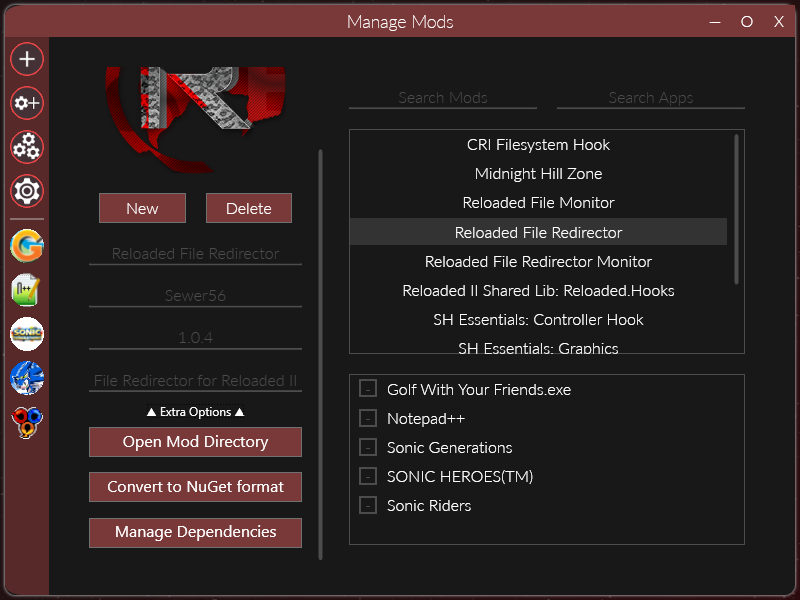

# Publishing Mods

---
**Warning**

Please be careful to not include any configuration files inside your mod updates as doing so would overwrite the user's own settings.

---

At the time of writing the supported archive formats are: `rar`, `zip`, `tar`, `gzip`, `7z`, `lz`

See [SharpCompress Supported Format Table](https://github.com/adamhathcock/sharpcompress/blob/master/FORMATS.md#supported-format-table) for more details.

## Supported Update Sources

When the mod loader checks for updates, it will use the first source it finds from the list below (in the order used in this document).

This is to speed up the time it takes to check for updates, as asking every source for every mod could otherwise take significant amount of time.

### NuGet

NuGet is the primary source for downloading mods and searching for missing mod dependencies.
Users can directly download mods via the `Download Mods` menu.

Reloaded comes preconfigured with a single [official server](http://167.71.128.50:5000/home) intended for hosting code mods.

#### Creating a Package
You can generate a NuGet package for your mod from inside the launcher using the `Convert to NuGet format` button.



Once conversion completes, Reloaded will open a folder containing the newly generated `.nupkg` file.

---
**Note**

There also exists a standalone NuGet Package Converter; you can get it from either of the 2 sources:

- Via [Github Releases](github.com/Reloaded-Project/Reloaded-II/releases) (`Tools.zip`).
- Via [Chocolatey](https://chocolatey.org/packages/reloaded-ii-tools).

---

#### Uploading Packages

You can now upload this to a NuGet server. The easiest way is to install the [.NET SDK](https://dotnet.microsoft.com/download/dotnet/thank-you/sdk-5.0.101-windows-x64-installer) and use the `dotnet` commandline utility. 

Example: 

```
# Upload package.nupkg to the official Reloaded server.
dotnet nuget push -s http://167.71.128.50:5000/v3/index.json -k API-KEY package.nupkg
```

[Upload instructions for the official Reloaded package server](http://167.71.128.50:5000/upload).

### GitHub

Support for mod updates from GitHub Releases can be added by copying the `ReloadedGithubUpdater.json` file from the Launcher's `Template` folder the to mod folder.

After copying, you should then edit the file to include the user/organization name, repository and name of the mod archive.

*Example:*

```json
{
  "UserName": "Reloaded-Project",
  "RepositoryName": "Reloaded.Mod.Universal.Redirector",
  "AssetFileName": "Mod.zip"
}
```

#### Determining Version
To determine the current version of the mod, the GitHub service uses the `ModVersion` field inside of your mod's `ModConfig.json`.

It compares the version to the tag, which is set when you make a release on GitHub:


If the GitHub version is higher than the local one, there is an update.

#### User Configuration

Each mod with GitHub update support can be configured by the user. This can be done by editing the `ReloadedGithubUserConfig.json`  file, in the mod folder using a standard text editor. 

**Example file:**
```json
{
  "LastCheckTimestamp": 0,
  "EnablePrereleases": false
}
```

If not present, this file will appear the next time the Reloaded Launcher is launched.

**Note:** *ReloadedGithubUserConfig.json should not be included in any mod downloads!*

#### Limitations
- Prereleases are supported but semantic versioning is not. Please do not add any prefixes/suffixes to your release tags.

- GitHub only allows 60 requests an hour for unauthenticated users. This means that if you have many mods with GitHub update support, they might not receive updates immediately.
	- The GitHub service tracks when each mod has been checked, ensuring that each mod gets the chance to check for updates, even if there are more than 60.

### GameBanana

Support for mod updates from GameBanana can be added by copying the `ReloadedGamebananaUpdater.json` file from the Launcher's `Template` folder the to mod folder.

First, [upload your mod as a private submission](./Images/GameBananaPrivate.png), copy the file to your mod folder and then edit the file to include the entry ID and type.

*Example:*

```json
{
  "FileNamePattern": "rii-",
  "ItemType": "Skin",
  "ItemId": 162715
}
```

#### File Name Pattern
Specifies text which must be contained by the file used for updates. 
The default is `rii-`, so a valid file names could be: 

- `rii-supercoolmod.zip`.
- `supercoolmod-rii-by-coolguy123.zip`

The pattern is used to distinguish the Reloaded II download from downloads that might come in other formats, e.g. for other mod loaders and/or extras.

##### File Pattern Guidelines

✅ Piece of text at the beginning (preferred) or end of the file name.

✅ Use a pattern that will only match the name of one file.

❌ Do not include file extensions in your pattern.

Gamebanana adds suffixes to duplicate file names, even if original file is removed. So if you upload `rii-midnighthill.7z`, remove it, and reupload it again, the file might be named something like `rii-midnighthill_eaa22.7z`.

---
Warning

- Some characters are removed/replaced when uploading files to GameBanana.
- Long file names (~32+ characters) might get trimmed down.
- Text comparison used is case insensitive.

---

#### Item Id
The Item ID of your submission can be obtained from the URL of your submission: 


#### Item Type
A list of item types can be obtained from the following page: [GameBanana API Item Types](https://api.gamebanana.com/Core/Item/Data/AllowedItemTypes?). 

The item type should match the submission type of your mod. The type of submission of your mod can be found in the URL in plural form.

e.g. `gamebanana.com/skins/162715`=> `Skin`

e.g. `gamebanana.com/gamefiles/7104`=> `Gamefile`

#### Determining Version
To compare versions of the mod, the GameBanana service uses the `Upload Date` of the and compares it against the last modified date of your mod's `ModConfig.json`.

If the GameBanana upload is more recent than the last edit of `ModConfig.json`, a new update will be reported.

## Adding Support (for Programmers)

Here is a simple rundown of how to add a new service for a 3rd party website.

### 1. Write a Resolver
Inside the `Resolvers` folder of the `Reloaded.Mod.Loader.Update` project, write a class that implements the `IModResolver` class.

**Example:** See `GitHubLatestUpdateResolver`.

The class only needs to be able to determine if there's a newer version, Reloaded-II will always autoselect newest version to update regardless of how many updates are available.

### 2. Add resolver to list of Resolvers

Inside `ResolverFactory`, add your new resolver to the `Resolvers` array inside `ResolverCollection`.
